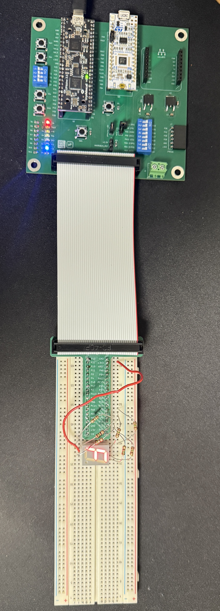
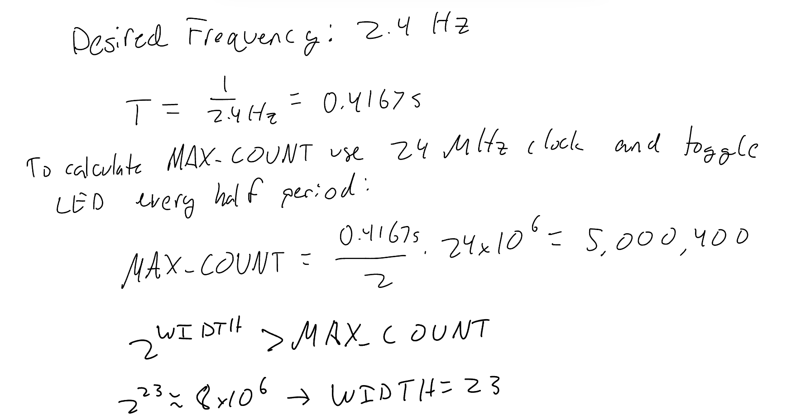
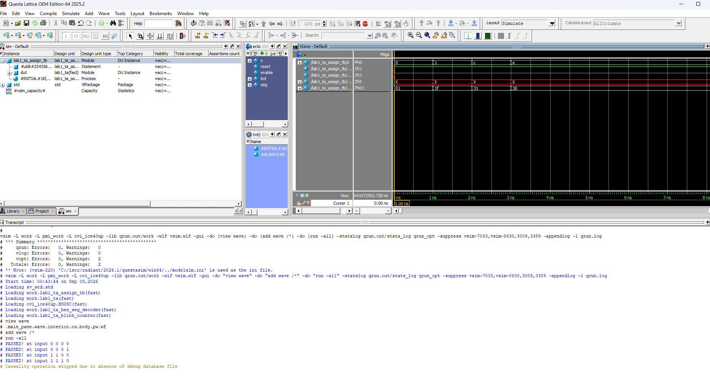
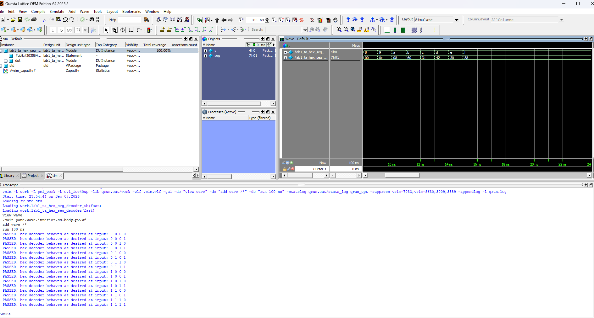
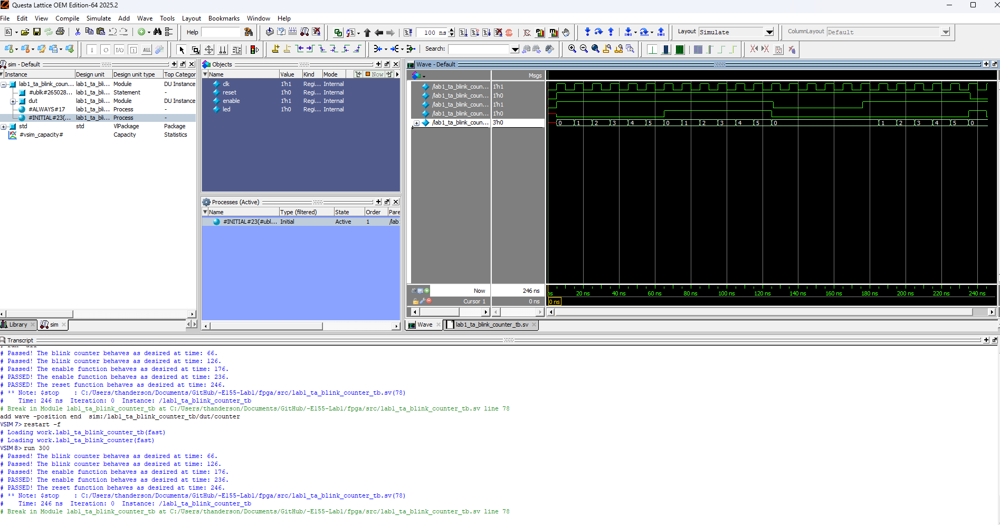
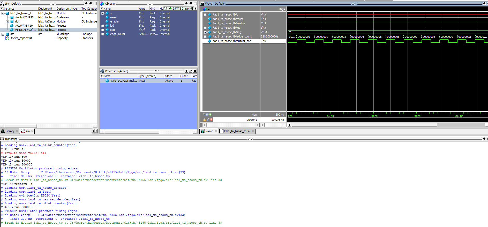
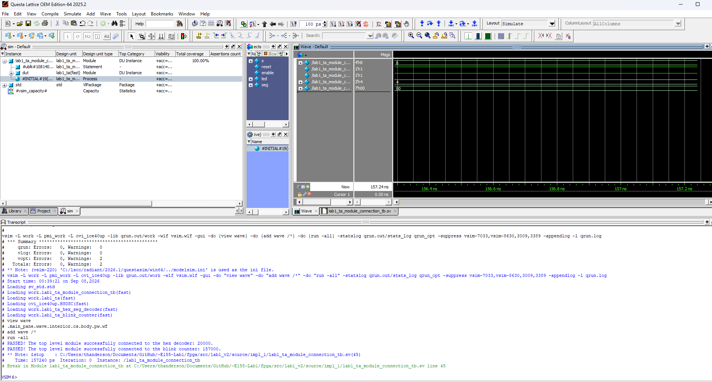
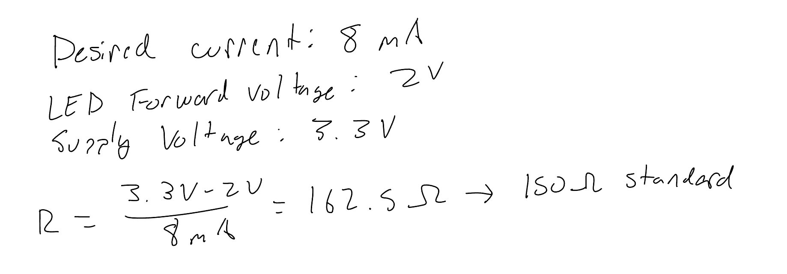
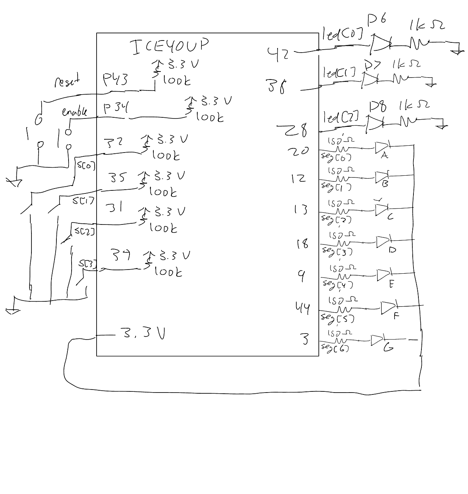
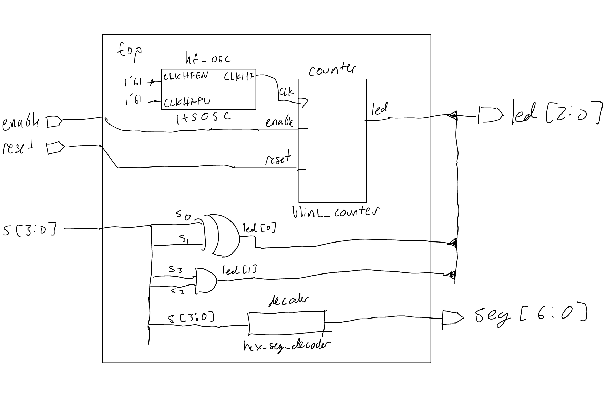

## Introduction
Lab 1 introduced the FPGA and microcontroller development tools used in E155. The FPGA portion focused on implementing and testing combinational and sequential logic on the UPduino v3.1, including switch-controlled LEDs, a hexadecimal 7-segment decoder, and a blinking LED driven by the FPGA's internal high frequency oscillator. The design was divided into separate SystemVerilog modules and verified through simulation before being tested on the physical hardware.

## Hardware

### FPGA and 7-Segment Functionality


The FPGA design was successfully synthesized and programmed onto the UPduino v3.1. The four input switches, `s[3:0]`, represent a 4-bit hexadecimal value, with `s[3]` as the most significant bit and `s[0]` as the least significant bit. The 7-segment display correctly displayed the corresponding hexadecimal digit from 0 through F for all 16 possible
switch combinations, with each combination producing a unique display output. The remaining LED outputs were used to verify the required combinational switch logic and blink-counter functionality. Physical testing confirmed that the FPGA implementation behaved as expected, and that the development board was properly soldered.

{width=50%}

## Verilog Structure and Style
The source code for the project can be found in the associated [Github repository](https://github.com/thivenanderson/-E155-Lab1) .
### Top-Level Module

The top-level module connects the inputs and outputs of the FPGA to the individual components of the design. The UPduino's internal high-speed oscillator (`HSOSC`) provides the clock signal used by the blink counter. The two combinational LED functions are implemented directly in the top-level module using two single line `assign` statements. The hexadecimal 7-segment decoder and blink counter are implemented as separate modules and instantiated within the top level.

The blink counter is parameterized when instantiated, allowing its counter width and maximum count to be specified without modifying the counter module itself. The `reset` and `enable` signals are passed from the top-level inputs to the blink counter, while the counter output drives `led[2]`. It should be noted reset is active-low as the board only contains internal pull up resistors. This modular structure separates the combinational, decoding, and sequential portions of the design.

<details>
<summary>Full top-level SystemVerilog</summary>

```systemverilog
module lab1_ta (
    input  logic [3:0] s,
	input logic reset, enable,
    output logic [2:0] led,
    output logic [6:0] seg
);

    logic int_osc;

    // Internal oscillator
    HSOSC #(.CLKHF_DIV(2'b01))
        hf_osc (
            .CLKHFPU(1'b1),
            .CLKHFEN(1'b1),
            .CLKHF(int_osc)
        );

    // LED comb logic
    assign led[0] = s[1] ^ s[0];
    assign led[1] = s[3] & s[2];

    // 7-segment decoder
    lab1_ta_hex_seg_decoder decoder (
        .s(s),
        .seg(seg)
    );

    // Blink counter logic
    lab1_ta_blink_counter #(
    .WIDTH(23),
    .MAX_COUNT(5_000_399) 	 	
		)counter(
        .clk(int_osc),
		.reset(reset),
		.enable(enable),
        .led(led[2])
    );

endmodule
```

</details>


### Hexadecimal 7-Segment Decoder

The hexadecimal 7-segment decoder was implemented as a separate combinational module. The decoder takes the four-bit switch input `s[3:0]`, representing a hexadecimal value from 0 to F, and produces the seven-bit output `seg[6:0]` that controls the individual segments of the display. A `case` statement maps each of the 16 possible input values to its corresponding 7-segment pattern.

The 7-segment display uses active-low logic, meaning that a segment is illuminated when its corresponding output bit is `0` and turned off when it is `1`. A `default` case is also included so that `seg` is assigned for any unspecified or unknown input, ensuring that the combinational logic always has a defined output and there is no implied latch.

<details>
<summary> 7-segment decoder SystemVerilog snippet</summary>

```systemverilog
	always_comb begin
    case (s)
        4'h0: seg = 7'b1000000;
        4'h1: seg = 7'b1111001;
        4'h2: seg = 7'b0100100;
		    4'h3: seg = 7'b0110000;
        // Additional hexadecimal values
        default: seg = 7'b1111111;
    endcase
end      
```

</details>


### Blink Counter

The blink counter was implemented as a separate sequential logic module. The module contains a counter that increments on each rising edge of the input clock while `enable` is high. When the counter reaches `MAX_COUNT`, the counter returns to zero and the LED output toggles. Repeated toggling produces the desired blinking behavior. The value of `MAX_COUNT` was calculated as shown below

{width=50%}

The module uses the parameters `WIDTH` and `MAX_COUNT` so that the counter can be reused with different counter sizes and terminal counts. `WIDTH` determines the number of bits in the counter, while `MAX_COUNT` determines how many clock cycles occur between LED toggles. This parameterization was useful during simulation because a much smaller maximum count could be used to observe the counter behavior without simulating millions of clock cycles.

The counter also includes an active-low synchronous reset and an active-high enable. When `reset` is low on a rising clock edge, both the counter and LED are reset to zero. When `reset` is high and `enable` is high, normal counting occurs. When `enable` is low, the counter and LED retain their current states.

<details>
<summary>Blink-counter SystemVerilog snippet</summary>

```systemverilog
always_ff @(posedge clk, posedge reset) begin
		
			if (!reset) begin
				counter <= 0;
				led <= 0;
				end
			 else if (enable) begin
				 if (counter == MAX_COUNT)begin
					counter <= 0;
					led <= ~led;
				 end
				else begin
					counter <= counter +1;
				end
			end
			else
				counter <= counter;
	end
endmodule
```

</details>


## Simulation and Verification

eparate testbenches were used to verify each module and the top-level connections before programming the FPGA.


### Switch-to-LED Logic Testbench

The combinational LED logic was tested by applying several switch combinations and asserting that `led[0]` and `led[1]` matched their expected values. This verified the continuous `assign` statements in the top-level module.

<details>
<summary>Switch-to-LED testbench waveform</summary>



</details>


### 7-Segment Decoder Testbench


The decoder testbench applies all 16 possible values to `s[3:0]` and uses assertions to verify the corresponding 7-segment output. This confirms that each hexadecimal value from 0 to F produces the expected display pattern.


<details>
<summary>7-segment decoder simulation waveform</summary>



</details>


### Blink Counter Testbench

The blink counter was simulated with a reduced `MAX_COUNT` of 5 to make its behavior easy to observe. Assertions verify that the LED toggles at the maximum count and that the reset and enable functions behave correctly.


<details>
<summary>Blink-counter simulation waveform</summary>



</details>


### HSOSC Testbench

The internal high-speed oscillator was verified by counting rising edges of `int_osc` during simulation. The test passes if at least one rising edge is detected, confirming that the oscillator is active.

<details>
<summary>HSOSC testbench simulation waveform</summary>


</details>

### Top-Level Module Connection Testbench

The top-level connection testbench verifies that the decoder and blink counter are connected correctly to the top-level inputs and outputs.
<details>
<summary>Top-level module connection testbench simulation waveform</summary>



</details>

## Design Calculations


### 7-Segment LED Current

The current-limiting resistor value was determined using the LED forward voltage specified in the HDSP-511C datasheet. The calculation below uses the supply voltage, LED forward voltage, and desired current to determine the resistor value.

{width=50%}

The resulting current is within the expected operating range.


## Schematic
Full Lab 1 schematic below.

{width=50%}

## Block Diagram

Block diagram showing the logical structure of the FPGA design.


{width=50%}


## Requirements Verification

The completed FPGA design met the Lab 1 requirements. The required hardware behavior was verified on the physical FPGA, while the SystemVerilog modules and their top-level connections were verified using automated testbenches. The 7-segment decoder correctly handled all 16 hexadecimal inputs, the blink counter correctly implemented its maximum count, reset, and enable functionality, and the LED blinked at the correct frequency.


## AI Prototype and Reflection

I asked ChatGPT to generate SystemVerilog to blink and LED at 2Hz. It only took one additional prompt that contained the error code produced by radiant before generating code that compiled. The  full chat log can be seen below.
<details>
<summary>Chat log</summary>


<details>
The quality of the output is similar to what I would produce as a preliminary design however there are some issues. Most noticeably the value of count is initialized at 0 instead of a reset being implimented. This works in software and will compile, but it does not translate directly to hardware as all HDL should. It did not generate any syntax I was unfamiliar with and successfully took advantage of SystemVerilog syntax as described in the prompt.

The reason the code did not synthesize the first time as it  used the incorrect syntax to synthesize the HSOSC. It claims "`SB_HFOSC` is the name commonly used with open-source ICE40", which is not correct for the environment specified. Radiant ouptut an error message as it did not recognize the module. This provides insight into AI's bias towards most commonly used syntax instead of neccessary syntax.

Next time I used LLM in a workflow I would give it a much more in depth prompt that specified things like, "this must map directly to hardware", to see if it can intuitively add resets. I would also give it more specification sheets relating to the environment and software I'm using to avoid syntax errors like the one that arose.

## Time Spent

Total time spent on Lab 1: **18 hours**
