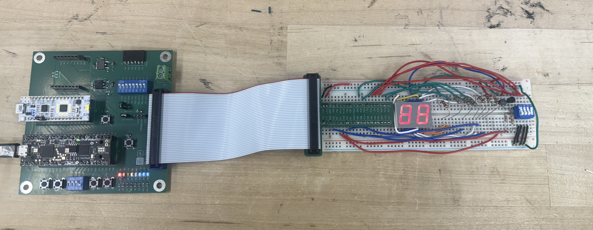
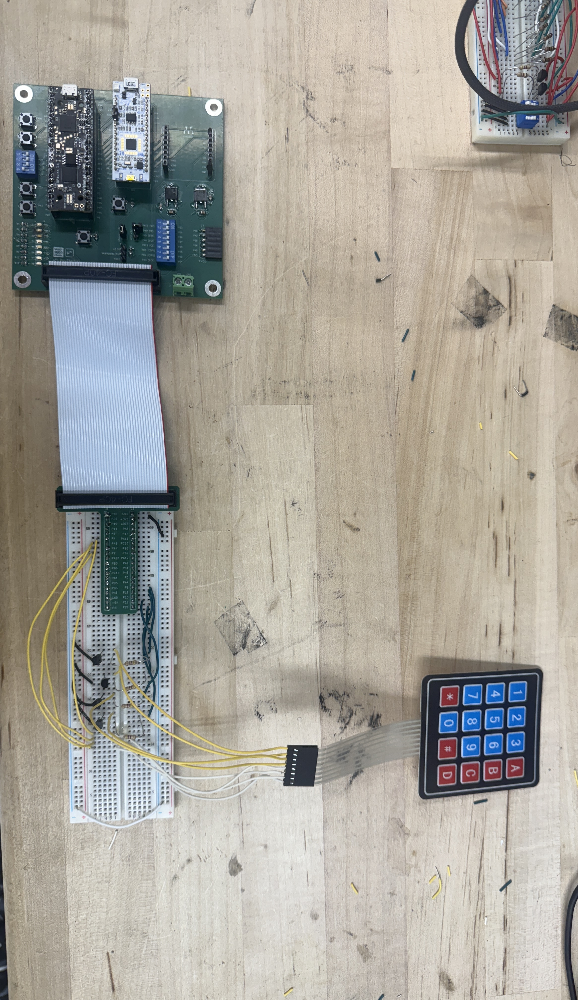
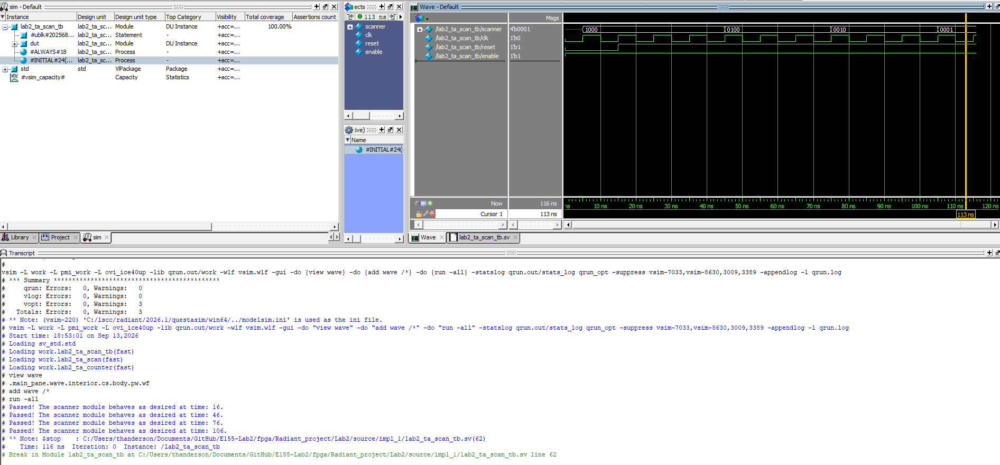
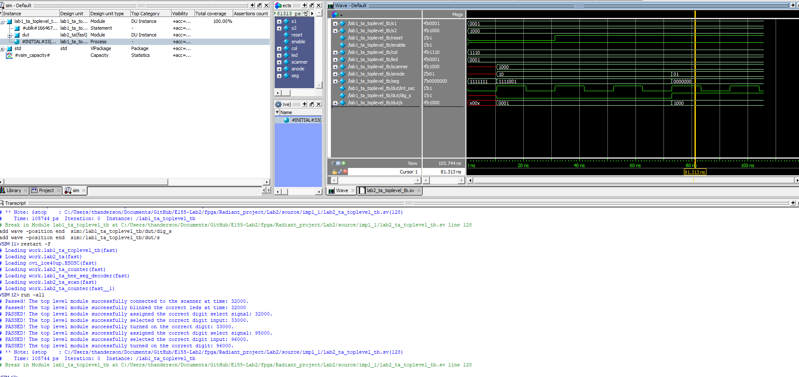
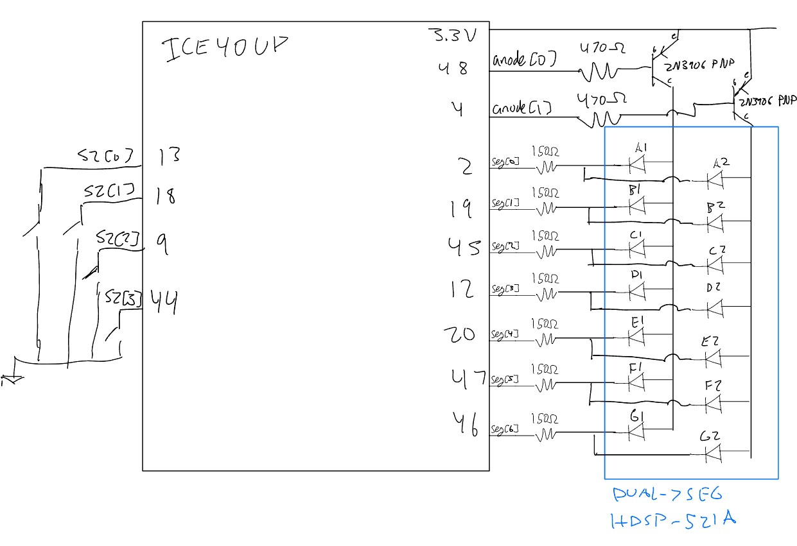
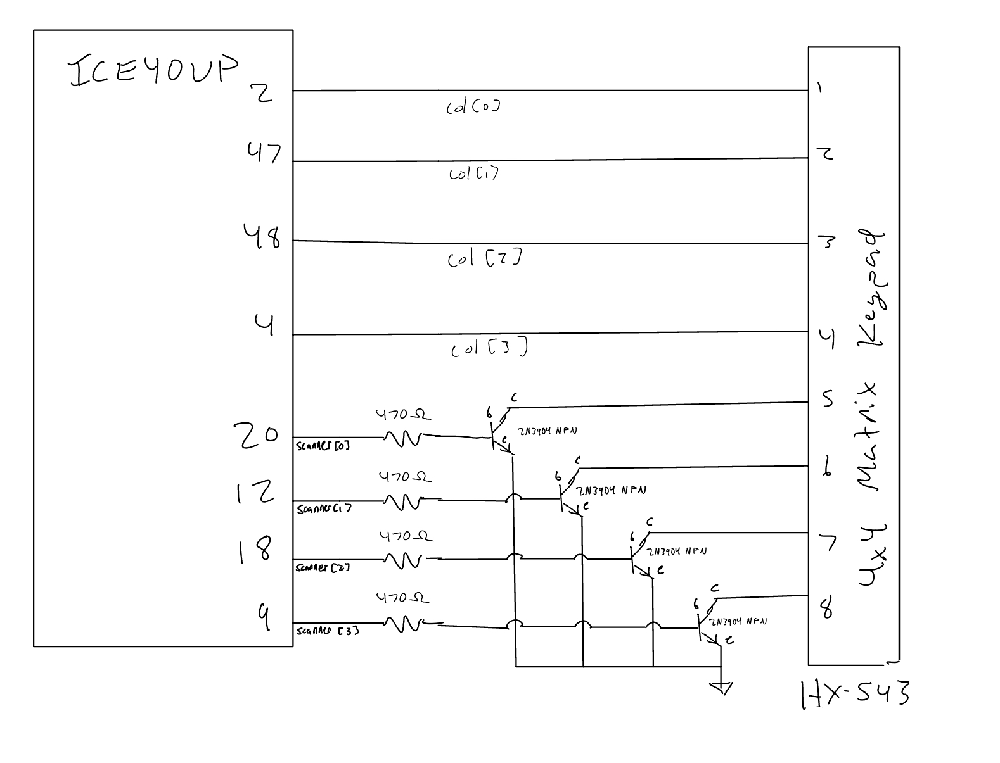
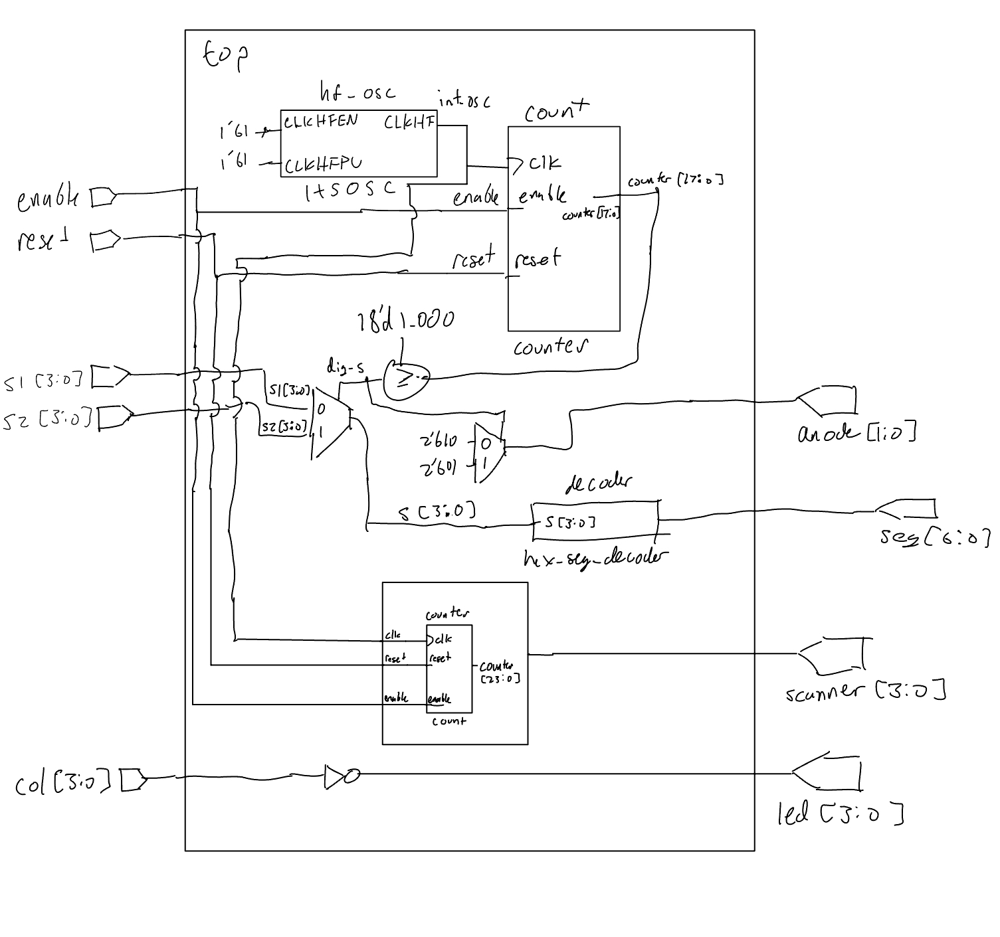

## Introduction

Lab 2 focused on using time multiplexing and modular SystemVerilog design to efficiently use the FPGA's I/O pins. The first portion of the lab used a single hexadecimal 7-segment decoder to drive two independent hexadecimal digits on a dual 7-segment display. A counter and multiplexing logic were used to alternate between the two digits quickly enough that both appeared continuously illuminated.

The second portion of the lab implemented a 4-output scanning circuit for a 4x4 matrix keypad. The scanner cycles through `1000`, `0100`, `0010`, and `0001`, allowing each row of the keypad to be asserted individually. The keypad columns are read back into the FPGA and passed to LEDs so that a pressed key causes the corresponding scanning signal to appear on an LED.

The design reused a parameterized counter module for both the display multiplexing and keypad scanning functions. For hardware testing, the display and keypad portions were programmed as separate FPGA bitstreams on two boards. This implementation was approved for this lab; however, the SystemVerilog design and documentation are presented as a single top-level system containing both functions.

## Hardware

### Multiplexed 7-Segment Display

The dual 7-segment display was used to display two independent four-bit hexadecimal inputs, `s1[3:0]` and `s2[3:0]`. Rather than using a separate decoder for each digit, both digits share the same hexadecimal decoder and cathode connections. The FPGA rapidly switches between the two input values while enabling only the corresponding display anode.

The multiplexing counter determines which digit is active. During the first half of the counter period, `s1` is passed to the decoder and the first anode is enabled. During the second half, `s2` is passed to the same decoder and the second anode is enabled. Because this switching occurs much faster than can be visually resolved, both digits appear to be illuminated continuously.

{width=50%}

### Keypad Scanner

The keypad portion of the design uses four scanner outputs connected to the four keypad rows. The scanner cycles through the patterns `1000`, `0100`, `0010`, and `0001`, asserting one row at a time. The keypad columns are connected back to FPGA input pins. Pressing a key electrically connects the currently scanned row to its corresponding column.

The column inputs are active-low in the implemented circuit, so the top-level module inverts `col[3:0]` before driving the four LEDs. As the scanner moves from row to row, a held key therefore causes the appropriate LED to blink when its row is asserted.

The keypad interface was also designed to tolerate multiple simultaneous key presses using the required transistor/pullup arrangement rather than directly shorting actively driven FPGA outputs together.

{width=50%}

## Verilog Structure and Style

The source code for the project can be found in the associated [Github repository](https://github.com/thivenanderson/E155-Lab2).

### Top-Level Module

The top-level module connects the oscillator, display multiplexing logic, keypad scanner, 7-segment decoder, and FPGA I/O. The UPduino's internal high-speed oscillator (`HSOSC`) is configured with `CLKHF_DIV = 2'b01`, producing the clock used by both counter-based functions.

For the display, a parameterized instance of `lab2_ta_counter` generates the multiplexing count. The internal signal `dig_s` is low during the first half of the count and high during the second half. This signal controls both a multiplexer that selects between `s1` and `s2` and the `anode` output that selects the active display digit. The selected four-bit value is passed to the same hexadecimal 7-segment decoder developed in Lab 1.

A separate `lab2_ta_scan` module generates the four keypad row signals. The keypad column inputs are then inverted with a single continuous assignment and passed directly to the LEDs.

<details>
<summary>Full top-level SystemVerilog</summary>

```systemverilog
module lab2_ta #(
    parameter int MAX_COUNT = 200_000,
    parameter int WIDTH = 18
)(
    input  logic [3:0] s1, s2,
    input  logic reset, enable,
    input  logic [3:0] col,
    output logic [1:0] anode,
    output logic [6:0] seg,
    output logic [3:0] led, scanner
);

    logic int_osc;
    logic dig_s;
    logic [3:0] s;
    logic [WIDTH-1:0] counter;

    // Internal oscillator
    HSOSC #(.CLKHF_DIV(2'b01))
        hf_osc (
            .CLKHFPU(1'b1),
            .CLKHFEN(1'b1),
            .CLKHF(int_osc)
        );

    // Dual display mux logic
    lab2_ta_counter #(
        .WIDTH(WIDTH),
        .MAX_COUNT(MAX_COUNT)
    ) count (
        .clk(int_osc),
        .reset(reset),
        .enable(enable),
        .counter(counter)
    );

    assign dig_s = (counter >= MAX_COUNT/2);
    assign s = dig_s ? s2 : s1;
    assign anode = dig_s ? 2'b01 : 2'b10;

    // Reused Lab 1 7-segment decoder
    lab1_ta_hex_seg_decoder decoder (
        .s(s),
        .seg(seg)
    );

    // Scanning module
    lab2_ta_scan #(
        .WIDTH(24),
        .MAX_COUNT(11_999_999)
    ) scan (
        .clk(int_osc),
        .reset(reset),
        .enable(enable),
        .scanner(scanner)
    );

    // Keypad column-to-LED logic
    assign led = ~col;

endmodule
```

</details>

### Parameterized Counter

A generic counter module is reused for both the display multiplexer and keypad scanner. The counter module is identical to the one for Lab 1, however, it outputs `counter` instead of blinking the LED.

<details>
<summary>Parameterized counter SystemVerilog</summary>

```systemverilog
module lab2_ta_counter #(
    parameter int WIDTH = 23,
    parameter int MAX_COUNT = 5_000_399
)(
    input logic clk, reset, enable,
    output logic [WIDTH-1:0] counter
);

    always_ff @(posedge clk) begin
        if (!reset)
            counter <= 0;
        else if (enable) begin
            if (counter == MAX_COUNT)
                counter <= 0;
            else
                counter <= counter + 1;
        end
        else
            counter <= counter;
    end
endmodule
```

</details>

### Keypad Scanning Module

The scanner is implemented as a separate module containing only an instance of the generic counter and continuous output logic. The total count range is divided into four sections. Each scanner output is high during one quarter of the counter period, producing the required sequence:

`1000` -> `0100` -> `0010` -> `0001`

Because the scanner reuses the generic counter, its reset and enable behavior are inherited directly from the counter module.

```systemverilog
assign scanner[3] = (counter <= MAX_COUNT/4);
assign scanner[2] = (counter > MAX_COUNT/4 && counter <= MAX_COUNT/2);
assign scanner[1] = (counter > MAX_COUNT/2 && counter <= 3*MAX_COUNT/4);
assign scanner[0] = (counter > 3*MAX_COUNT/4);
```

<details>
<summary>Full scanning module SystemVerilog</summary>

```systemverilog
module lab2_ta_scan #(
    parameter WIDTH = 24,
    parameter MAX_COUNT = 11_999_999
)(
    input logic clk, reset, enable,
    output logic [3:0] scanner
);

    logic [WIDTH-1:0] counter;

    lab2_ta_counter #(
        .WIDTH(WIDTH),
        .MAX_COUNT(MAX_COUNT)
    ) count (
        .clk(clk),
        .reset(reset),
        .enable(enable),
        .counter(counter)
    );

    assign scanner[3] = (counter <= MAX_COUNT/4);
    assign scanner[2] = (counter > MAX_COUNT/4 && counter <= MAX_COUNT/2);
    assign scanner[1] = (counter > MAX_COUNT/2 && counter <= 3*MAX_COUNT/4);
    assign scanner[0] = (counter > 3*MAX_COUNT/4);

endmodule
```

</details>

### Reused Hexadecimal 7-Segment Decoder

The hexadecimal decoder developed and verified in Lab 1 was reused without modification.

<details>
<summary>7-segment decoder SystemVerilog snippet</summary>

```systemverilog
always_comb begin
    case (s)
        4'h0: seg = 7'b1000000;
        4'h1: seg = 7'b1111001;
        4'h2: seg = 7'b0100100;
        4'h3: seg = 7'b0110000;
        // Additional hexadecimal values
        4'hF: seg = 7'b0001110;
        default: seg = 7'b1111111;
    endcase
end
```

</details>

## Simulation and Verification

The new Lab 2 modules and their top-level connections were verified using automated testbenches. Modules already tested in Lab 1, such as the hexadecimal decoder, were not independently simulated again.

### Scanner Testbench

The scanner testbench reduces the counter to `WIDTH = 4` and `MAX_COUNT = 11`. This allows all four scanner states to be observed after only a few clock cycles instead of requiring the full hardware count.

After reset is released, assertions check that the scanner progresses through `1000`, `0100`, `0010`, and `0001` in order. The reduced parameter values preserve the same four-region structure used in the hardware implementation.

<details>
<summary>Scanner simulation waveform</summary>



</details>

<details>
<summary>Scanner testbench SystemVerilog</summary>

```systemverilog
lab2_ta_scan #(.WIDTH(4), .MAX_COUNT(11)) dut (
    .clk(clk),
    .reset(reset),
    .enable(enable),
    .scanner(scanner)
);

// ...

assert (scanner == 4'b1000);
// ...
assert (scanner == 4'b0100);
// ...
assert (scanner == 4'b0010);
// ...
assert (scanner == 4'b0001);
```

</details>

### Top-Level Module Testbench

The top-level testbench verifies that the major modules are connected correctly and that the multiplexing logic selects the intended signals. The top-level display counter is simulated with `WIDTH = 3` and `MAX_COUNT = 5` to allow both display states to be reached quickly.

The first portion checks that the scanner output reaches the top-level `scanner` port and that the active-low keypad column input is correctly inverted onto the LEDs. 

The display portion verifies the internal digit-select signal, selected hexadecimal input, and anode control.

<details>
<summary>Top-level simulation waveform</summary>



</details>

<details>
<summary>Top-level testbench SystemVerilog snippet</summary>

```systemverilog
s1 = 4'b0001;
s2 = 4'b1000;
col = 4'b1110;

// Test scanner connection and column logic
assert (scanner == 4'b1000);
assert (led == 4'b0001);

// Test first display
assert (dut.dig_s == 1'b0);
assert (dut.s == 4'b0001);
assert (anode == 2'b10);

// Advance counter and test second display
repeat(3) @(posedge dut.int_osc);

assert (dut.dig_s == 1'b1);
assert (dut.s == 4'b1000);
assert (anode == 2'b01);
```

</details>

## Design Calculations

### Display Multiplexing Frequency

The internal oscillator is operated at 24 MHz. The display counter uses `MAX_COUNT = 200,000`, so one complete counter cycle takes approximately

$$
T_{mux} = \frac{200001}{24\times10^6}
\approx 8.33\text{ ms}
$$

giving a complete multiplexing cycle frequency of approximately

$$
f_{mux} = \frac{1}{T_{mux}}
\approx 120\text{ Hz}.
$$

Each digit is enabled for approximately one half of this cycle, so the display switches between digits about every 4.17 ms. This switching rate is sufficiently fast that the two digits appear continuously illuminated rather than visibly alternating.


### Keypad Scanning Frequency

The scanner uses the same 24 MHz clock and `MAX_COUNT = 11,999,999`. Including count zero, the complete scan contains 12,000,000 clock cycles. Therefore,

$$
T_{scan} = \frac{12,000,000}{24,000,000}
= 0.5\text{ s}
$$

and

$$
f_{scan} = \frac{1}{0.5}
= 2\text{ Hz}.
$$

The counter period is split into four regions, so each row is asserted for approximately

$$
\frac{0.5}{4} = 0.125\text{ s}.
$$

This produces the required rotating scan pattern at the desired rate.

### FPGA Pin Current

The NPN and PNP transistor circuits were designed to keep the current sourced or sunk by an FPGA pin below 8 mA. The NPN circuit uses a 2N3904 transistor, while the PNP circuit uses a 2N3906 transistor. Based on the transistor datasheets, a base-emitter voltage drop of approximately 0.7 V was used for the design calculations. With a 3.3 V FPGA supply, the voltage across the transistor base resistor is therefore

$$
V_B = V_{CC} - V_{BE}
$$

$$
V_B = 3.3 - 0.7 = 2.6\text{ V}.
$$

A standard resistor value of 470 $\Omega$ was selected for both transistor base resistors. Using Ohm's law, the resulting FPGA pin current is

$$
I_B = \frac{V_R}{R_B}
= \frac{2.6}{470}
= 0.00553\text{ A}
\approx 5.53\text{ mA}.
$$

For the 2N3904 NPN transistor, the FPGA sources approximately 5.53 mA into the base when the transistor is turned on. For the 2N3906 PNP transistor, the FPGA sinks approximately 5.53 mA through the base resistor when the transistor is turned on. Therefore, the worst-case FPGA pin current for either transistor circuit is approximately 5.53 mA, which is below the 8 mA design limit.

## Schematic

## Schematic

Because the two portions of Lab 2 were tested separately in hardware, two schematics are included below: one for the multiplexed dual 7-segment display and one for the keypad scanner.

### Dual 7-Segment Display Schematic

The dual 7-segment display schematic shows the FPGA connections to the shared segment lines, digit-select circuitry, transistor drivers, and current-limiting resistors used to multiplex the two display digits.

The `enable` and `reset` inputs, are connected to the push buttons at pins 34 and 43. The DIP switches at pins 32, 35, 31, nd 37 are used for the first hexadecimal digit input. These are not shown because these components are already integrated onto the UPduino board. Internal FPGA pull-up resistors are also excluded from the schematic.

{width=75%}

### Keypad Scanner Schematic

The keypad scanner schematic shows the FPGA connections to the keypad row-driving transistor circuits, keypad column inputs, external pull-up resistors, and associated current-limiting resistors.

The LED outputs used to display the keypad column signals are not shown because the LEDs are already integrated onto the UPduino board. They are at FPGA pins 21(bridged to MCU pin B3), 42, 38, and 28. Internal FPGA pull-up resistors are also excluded from the schematic.

{width=75%}

## Block Diagram

The block diagram shows the logical organization of the complete SystemVerilog design. The `HSOSC` clock drives both parameterized counter-based functions. One counter controls the display multiplexer, which selects between `s1` and `s2` before passing the selected input to the single 7-segment decoder. The scanning module contains the second parameterized counter and converts its count into the four keypad row outputs. The keypad column inputs pass through inversion logic before driving the LEDs.

{width=75%}

## Requirements Verification

The Lab 2 design implemented the required time-multiplexed dual 7-segment display and keypad scanning functions. A single hexadecimal decoder was reused for both display digits, while parameterized instances of the same generic counter module were used for display multiplexing and keypad scanning. The scanning module contains only the reusable counter and combinational output assignments, while the top-level module connects the oscillator, counter, decoder, scanner, multiplexing assignments, and keypad passthrough logic.

Simulation verified the four scanner states and the main top-level connections. The top-level testbench also verified that the correct hexadecimal input and display anode were selected during each half of the multiplexing cycle.

The completed design met all Lab 2 requirements.

## AI Prototype and Reflection


For the AI prototype, I asked ChatGPT to generate SystemVerilog HDL that time multiplexes a single 7-segment decoder between two four-bit hexadecimal inputs. The initial prompt intentionally asked ChatGPT to disregard all previous E155 Lab 2 context so that the response would represent a fresh implementation based only on the information provided in the prompt.

In its first response, ChatGPT proposed using one combinational 7-segment decoder with an input multiplexer to select between the two four-bit inputs. It then routed the decoder output to one of two 7-segment outputs depending on a `select` signal. The initial design toggled `select` directly on each clock edge, although ChatGPT later noted that a counter should normally be used to reduce the multiplexing frequency when using a high-speed FPGA clock. It understood we are trying to generate a couple 100 Hz frequency from the hardware at hand. 
<details>
<summary>AI Prototype Intial Prompt SystemVerilog</summary>
module seven_seg_mux (
    input  logic       clk,
    input  logic [3:0] in0,
    input  logic [3:0] in1,
    output logic [6:0] seg0,
    output logic [6:0] seg1
);

    logic select;
    logic [3:0] digit;
    logic [6:0] decoded_seg;

    // Toggle between the two displays
    always_ff @(posedge clk) begin
        select <= ~select;
    end

    // Select which input goes into the single decoder
    always_comb begin
        if (select)
            digit = in1;
        else
            digit = in0;
    end

    // Single common-anode seven-segment decoder
    // Format: abcdefg
    always_comb begin
        case (digit)
            4'h0: decoded_seg = 7'b0000001;
            4'h1: decoded_seg = 7'b1001111;
            4'h2: decoded_seg = 7'b0010010;
            4'h3: decoded_seg = 7'b0000110;
            4'h4: decoded_seg = 7'b1001100;
            4'h5: decoded_seg = 7'b0100100;
            4'h6: decoded_seg = 7'b0100000;
            4'h7: decoded_seg = 7'b0001111;
            4'h8: decoded_seg = 7'b0000000;
            4'h9: decoded_seg = 7'b0000100;
            4'hA: decoded_seg = 7'b0001000;
            4'hB: decoded_seg = 7'b1100000;
            4'hC: decoded_seg = 7'b0110001;
            4'hD: decoded_seg = 7'b1000010;
            4'hE: decoded_seg = 7'b0110000;
            4'hF: decoded_seg = 7'b0111000;
            default: decoded_seg = 7'b1111111;
        endcase
    end

    // Route the single decoder output to the selected display
    // 1111111 = all segments off for common anode
    always_comb begin
        if (select) begin
            seg0 = 7'b1111111;
            seg1 = decoded_seg;
        end
        else begin
            seg0 = decoded_seg;
            seg1 = 7'b1111111;
        end
    end

endmodule
</details>

I then provided the Lab 1 top-level module, blink counter, and hexadecimal 7-segment decoder and asked ChatGPT to regenerate the design using the provided oscillator and decoder. The revised prototype instantiated the same `HSOSC` configuration used in Lab 1 and reused a single instance of `lab1_ta_hex_seg_decoder`. It added a counter to slow the 24 MHz oscillator and used a `select` signal to determine whether `s1` or `s2` was connected to the decoder. 

The AI-generated counter toggled the digit selection after a count of 11,999. With the 24 MHz oscillator, ChatGPT calculated that the selected display would change every 0.5 ms, giving each display an approximately 1 kHz refresh rate. The response also correctly recognized that the provided Lab 1 decoder used active-low segment outputs for a common-anode display.

<details>
<summary>AI Prototype Secondary Prompt SystemVerilog</summary>
module seven_seg_time_mux (
    input  logic [3:0] s1, s2,
    input  logic       reset,
    output logic [6:0] seg1, seg2
);

    logic int_osc;
    logic select;
    logic [3:0] mux_in;
    logic [6:0] decoded_seg;

    logic [14:0] counter;

    // Internal 24 MHz oscillator
    HSOSC #(.CLKHF_DIV(2'b01))
        hf_osc (
            .CLKHFPU(1'b1),
            .CLKHFEN(1'b1),
            .CLKHF(int_osc)
        );

    // Slow down oscillator for display multiplexing
    always_ff @(posedge int_osc) begin
        if (!reset) begin
            counter <= 0;
            select  <= 0;
        end
        else begin
            if (counter == 15'd11999) begin
                counter <= 0;
                select  <= ~select;
            end
            else begin
                counter <= counter + 1;
            end
        end
    end

    // Select which 4-bit input goes into the single decoder
    always_comb begin
        if (select)
            mux_in = s2;
        else
            mux_in = s1;
    end

    // Use ONE instance of your existing seven-segment decoder
    lab1_ta_hex_seg_decoder decoder (
        .s   (mux_in),
        .seg (decoded_seg)
    );

    // Route decoder output to the selected display
    // Common-anode: 7'b1111111 turns all segments off
    always_comb begin
        if (select) begin
            seg1 = 7'b1111111;
            seg2 = decoded_seg;
        end
        else begin
            seg1 = decoded_seg;
            seg2 = 7'b1111111;
        end
    end

endmodule
</details>

The AI generated prototype succesfully generated accurate HDL that would map to hardware without any additional prompting. The only main changes bewtten the AI model and mine is that I have my counter as a submodule and also my modules are paramaterized. The way this code is written a parameter for max count could be added, but is not neccessary as counter logic is part of the top level module. Adding Lab 1 modules certainly improved the quality of the design, as it had a known frequency to base the counter off of instead of assuming an clock input signal at the exact desired frequency. I think overall  the quality is very high and if I had given it more information in the first prompt about a decoder module and the 'HSOSC' it could have produced better code on the first shot.

## Time Spent

Total time spent on Lab 2: **12**
