## Introduction

Lab 3 extends the Lab 2 keypad scanner into a complete keypad interface. The FPGA scans a 4x4 keypad, synchronizes the asynchronous column inputs, rejects switch bounce and invalid multi-key conditions, and displays the two most recent valid hexadecimal keys on the dual 7-segment display. Each valid press is registered once regardless of hold time.

The complete SystemVerilog source and testbenches are available in the [Lab 3 GitHub repository](https://github.com/thivenanderson/E155-Lab3).

## Hardware

The design reuses the 4x4 keypad interface and dual 7-segment display hardware from [Lab 2](../lab2/lab2.qmd). Keypad columns are active-low asynchronous FPGA inputs, while the row-driving and display-multiplexing hardware are reused from the previous lab.

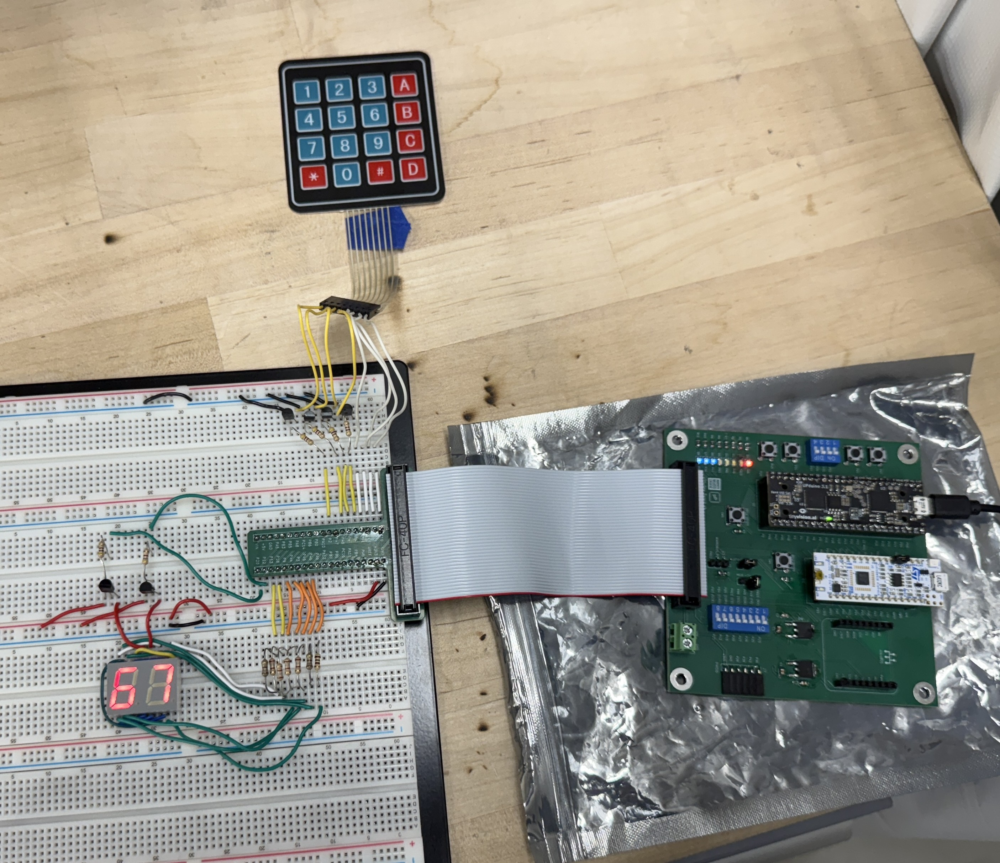{width=50%}

## Verilog Structure and Style

The top-level module contains only module instantiations and simple combinational connections. Previously verified Lab 1/2 modules are reused for the hexadecimal decoder and parameterized counters.

| Module | Function |
|---|---|
| `lab3_ta_sync` | Two-flop synchronization of the four asynchronous keypad columns |
| `lab3_ta_scanner` | Reused counter plus combinational logic to scan the four keypad rows |
| `lab3_ta_keypad_builder` | Captures each scanned row into a 16-bit keypad map |
| `lab3_ta_keypad_decoder` | Converts a one-hot keypad map into row, column, and hexadecimal values |
| `lab3_ta_controller` | Coordinates scanning, debounce timing, registration, and key release |
| `lab3_ta_savedkey_sr` | Stores the row and column of the candidate key |
| `lab3_ta_digit_sr` | Stores the newest and previous hexadecimal digits |

### Debouncing and Multi-Key Handling

After a complete scan, the controller accepts a candidate only when `$onehot(keypad)` is true. The selected row is then held active while the two-stage synchronizer settles. A reused counter requires the saved column to remain asserted for approximately 10 ms before generating a one-cycle `shift_enable` pulse.

Once a key is registered, the controller remains in `PRESSED` until that saved key is released. Additional keys are therefore ignored while the first key remains held. If several keys are detected during scanning, no key is saved; when the condition returns to exactly one held key, that remaining key can be registered.

This counter-based debounce is simple and deterministic. Its main tradeoff is a small fixed input delay. This delay of 10ms is excessive compared to oscilliscope measure debounce, but accounts for worst case scenarios.

### FSM Partitioning

The controller handles sequencing, while the scanner and debounce counter keep their own timing state and communicate with the controller using `scan_done`, `db_done`, reset, and enable signals. This keeps new state out of the top-level module and allows each stateful block to be tested independently.

## State Transition Diagram

```{mermaid}
stateDiagram-v2
    RESET --> SCAN
    SCAN --> CHECK: scan_done
    SCAN --> SCAN: !scan_done
    CHECK --> SAVE: one-hot keypad
    CHECK --> SCAN: else
    SAVE --> SETTLE
    SETTLE --> WAIT
    WAIT --> SCAN: saved column released
    WAIT --> PULSE: db_done
    WAIT --> WAIT: held and !db_done
    PULSE --> PRESSED
    PRESSED --> PRESSED: saved column low
    PRESSED --> SCAN: saved column released
```

## State Transition Table

| State | Next-state condition | Main asserted outputs |
|---|---|---|
| `SCAN` | `scan_done` -> `CHECK`; otherwise `SCAN` | `scan_enable`, `scan_reset` |
| `CHECK` | one-hot keypad -> `SAVE`; otherwise `SCAN` | `save_enable` for a valid one-hot key |
| `SAVE` | always -> `SETTLE` | none |
| `SETTLE` | always -> `WAIT` | none |
| `WAIT` | released -> `SCAN`; `db_done` -> `PULSE`; otherwise `WAIT` | `db_reset`, `db_enable` |
| `PULSE` | always -> `PRESSED` | `shift_enable` |
| `PRESSED` | released -> `SCAN`; otherwise `PRESSED` | none |

## Simulation and Verification

Every new module is covered by an automatic testbench. The previously verified generic counter and hexadecimal decoder are reused from [Lab 2](../lab2/lab2.qmd) and [Lab 1](../lab1/lab1.qmd), respectively, so their standalone simulations are not repeated.

The top-level keypad stimulus models active-low columns, asynchronous press timing, a transition directly on a system-clock edge, and switch bounce.

### Synchronizer

The waveform shows the two-stage delay: an asynchronous change first reaches the internal first-stage register and then appears at `q` on the following rising edge.

<details>
<summary>Synchronizer testbench waveform</summary>

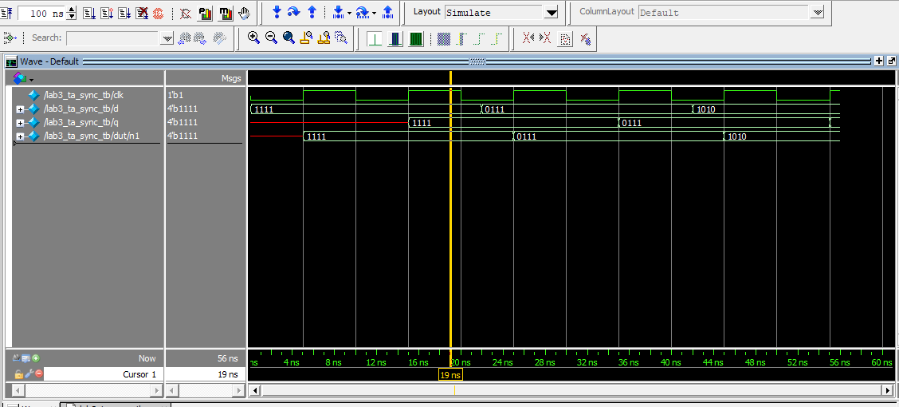

</details>

### Keypad Scanner

The scanner testbench verifies the `1000 -> 0100 -> 0010 -> 0001` row sequence, matching row indices, scan ticks, wraparound, and enable behavior.

<details>
<summary>Scanner testbench waveform</summary>

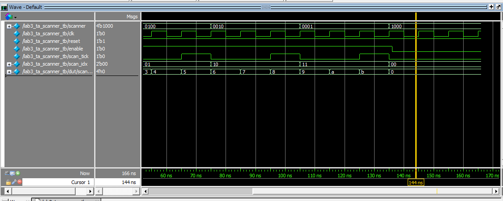

</details>

### Keypad Builder

Each scan tick stores the inverted synchronized columns into the correct four-bit portion of the 16-bit keypad map. The waveform builds `16'h8000 -> 16'h8400 -> 16'h8420 -> 16'h8421`, with `scan_done` asserted on the final row.

<details>
<summary>Keypad-builder testbench waveform</summary>

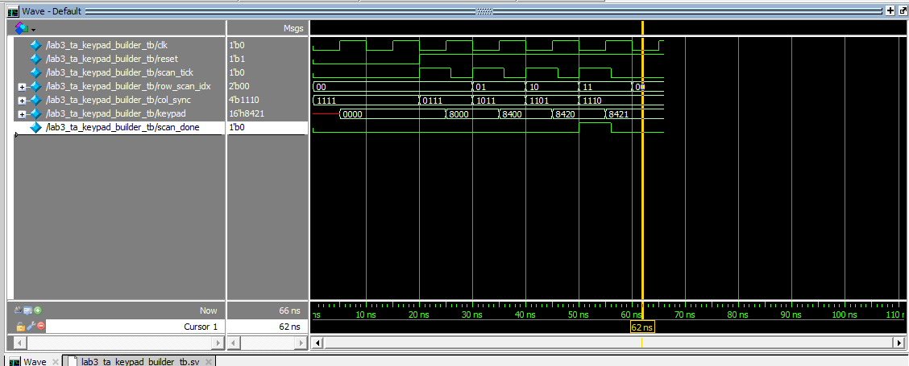

</details>

### Keypad Decoder

The combinational decoder testbench steps through all 16 one-hot keypad positions and verifies the corresponding hexadecimal, row, and column outputs.

<details>
<summary>Keypad-decoder testbench waveform</summary>

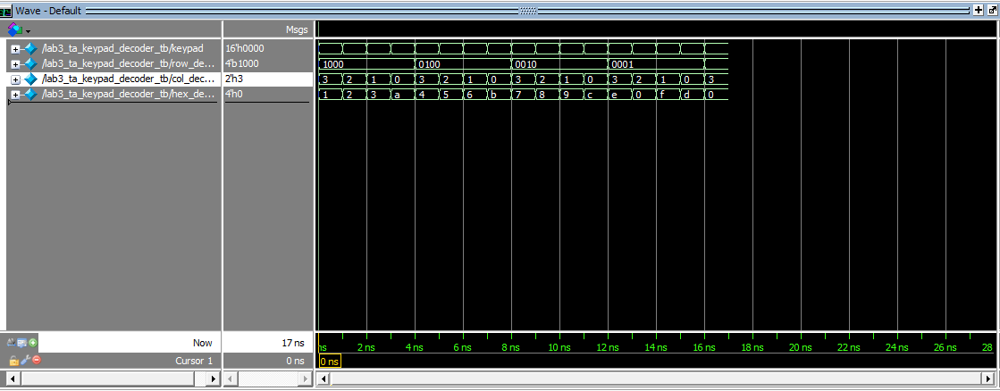

</details>

### Saved-Key Register

The saved-key register captures the decoded row and column only when enabled and holds its previous value while disabled.

<details>
<summary>Saved-key register testbench waveform</summary>

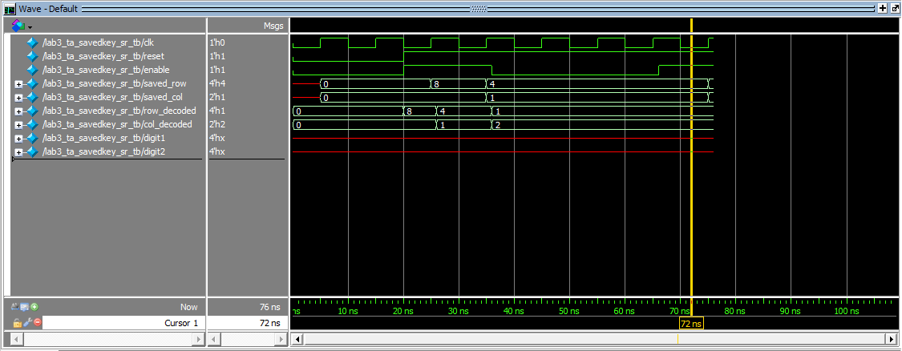

</details>

### Digit Shift Register

The display register resets to `00`, loads `A`, shifts to `5A`, holds while disabled, and then shifts to `C5`.

<details>
<summary>Digit shift-register testbench waveform</summary>

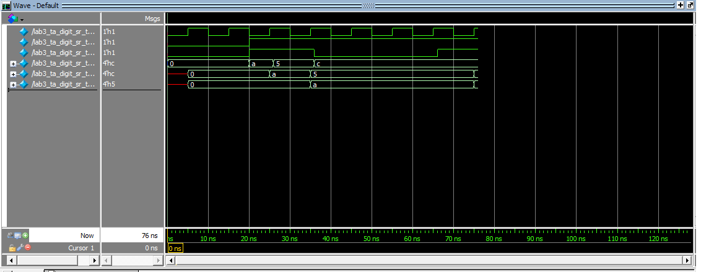

</details>

### Controller FSM

The controller waveform covers asynchronous reset, rejection of a multi-key map, a valid `SCAN -> CHECK -> SAVE -> SETTLE -> WAIT -> PULSE -> PRESSED` sequence, debounce completion, one-cycle `shift_enable`, held-key behavior, release, and return to scanning.

<details>
<summary>Controller testbench waveform</summary>

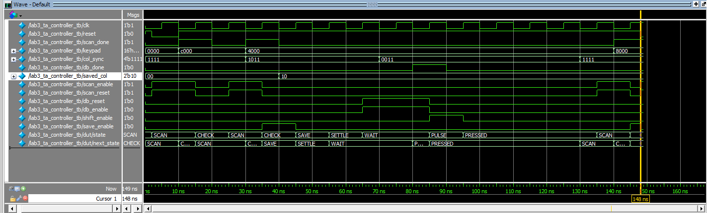

</details>

## Top-Level Verification

### Asynchronous Reset

Reset immediately returns the controller to `SCAN` and clears the saved key and both displayed digits.

<details>
<summary>Top-level reset waveform</summary>

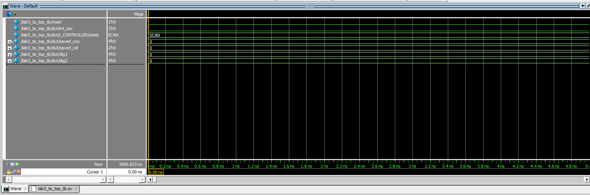

</details>

### Test 1: Bounce, Debounce, and Single Registration

The first waveform shows a bounced press of key `1` while the keypad continues scanning. After the complete keypad map contains one valid key, the controller leaves `SCAN` for `CHECK`.

<details>
<summary>Test 1a waveform</summary>

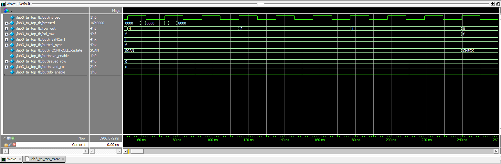

</details>

The second waveform shows the saved column settling through the synchronizer, the debounce counter reaching its terminal count, a one-cycle `shift_enable` pulse, and `digit1` updating to `1`. The controller then remains in `PRESSED`, preventing repeated registration while the key stays held.

<details>
<summary>Test 1b waveform</summary>

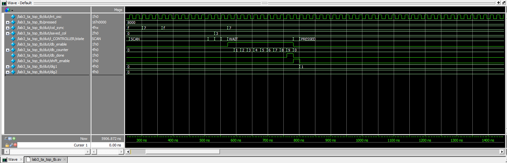

</details>

### Test 2: Two-Digit History

A valid press of key `5` produces the normal controller sequence and shifts the display history from `1,0` to newest=`5`, previous=`1`.

<details>
<summary>Test 2 waveform</summary>

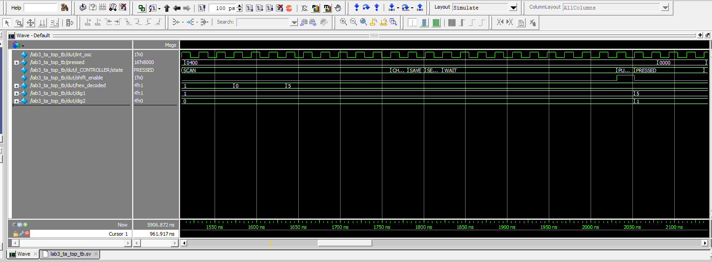

</details>

### Test 3: First-Key Priority and Roll-Off

Key `2` registers first. Key `9` is then pressed while `2` remains held; the controller stays in `PRESSED` and the display remains unchanged. When `2` is released while `9` remains held, scanning resumes and `9` becomes the next valid key.

<details>
<summary>Test 3 waveform</summary>

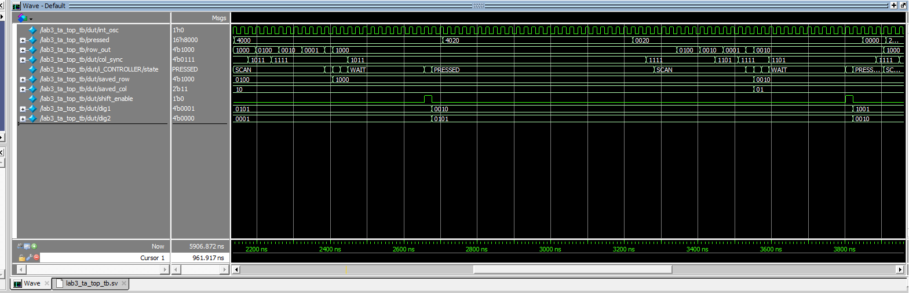

</details>

### Tests 4 and 5: Simultaneous Multi-Key Input

Keys `3` and `C` are initially held together. The keypad map is not one-hot, so the controller continues scanning and the stored digits remain `9,2`. After `3` is released, `C` is the only remaining key and is registered as the next digit.

<details>
<summary>Tests 4 and 5 waveform</summary>

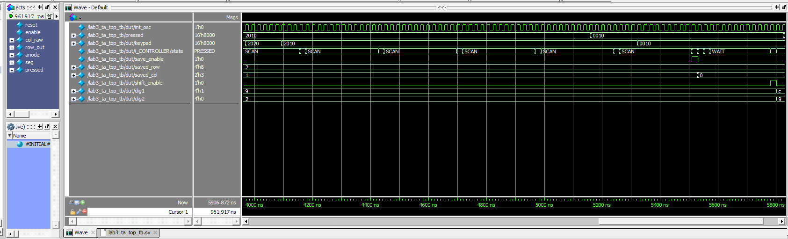

</details>

### Display Multiplexing

The final output test verifies the top-level connection from the digit registers through the reused display multiplexer and hexadecimal decoder. The saved waveform shows the `C` phase with the corresponding anode and segment output; the automatic testbench also asserts the opposite phase for the stored `9`.

<details>
<summary>Top-level display-multiplexing waveform</summary>

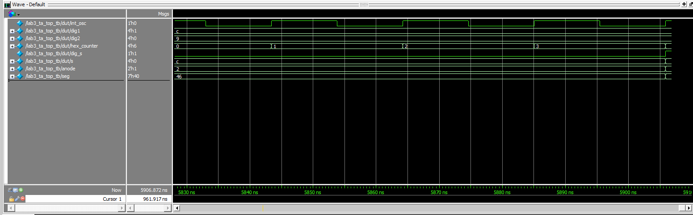

</details>

## Synthesis Output

Radiant synthesis completes without latch or tri-state warnings in the committed synthesis message log.

<details>
<summary>Radiant synthesis files</summary>

[Synthesis report](https://github.com/thivenanderson/E155-Lab3/blob/main/FPGA/Radiant_Project/Lab3/impl_1/Lab3_impl_1_lattice_lse.html)

[Message log](https://github.com/thivenanderson/E155-Lab3/blob/main/FPGA/Radiant_Project/Lab3/impl_1/message_log.xml)

</details>

## Schematic

The Lab 3 hardware combines the keypad and dual-display circuits developed in Lab 2.

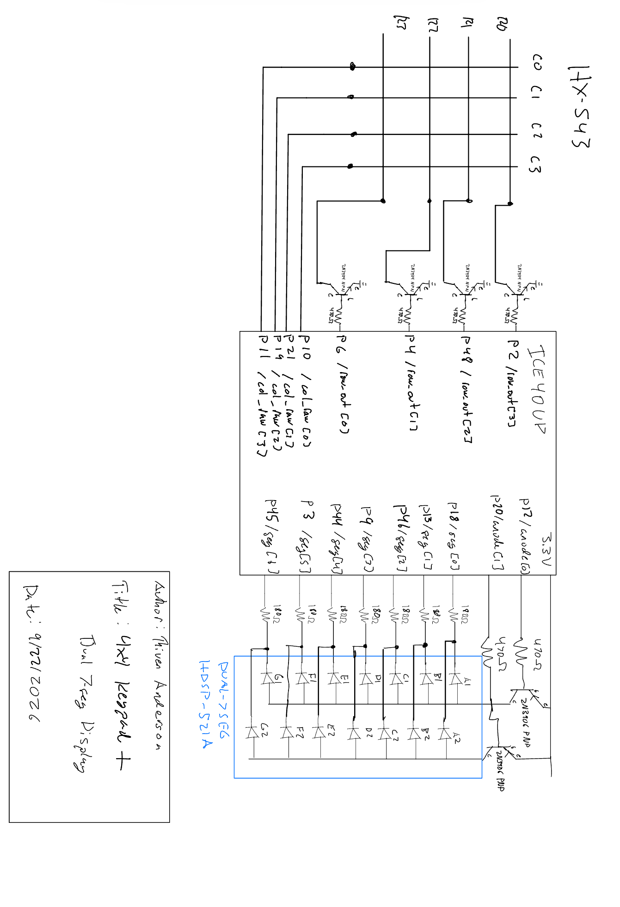{width=100%}

## Block Diagrams

<!-- TODO: add the required 1:1 block diagrams for the top-level and each module. -->

## Requirements Verification

Automatic simulation verifies single-key operation, one-time registration, debounce behavior, two-digit history, first-key priority, rejection of simultaneous multi-key input, and registration of the final remaining key after multi-key roll-off. The display connection is also checked automatically.

The physical display behavior also meets all required specifications, proficient and excellent.

## AI Prototype and Reflection

<!-- TODO: add the AI prototype output/transcript and a brief reflection. -->

## Time Spent

Total time spent on Lab 3: 25
