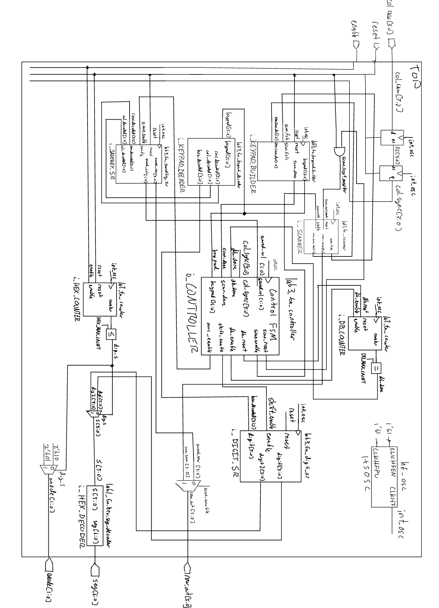
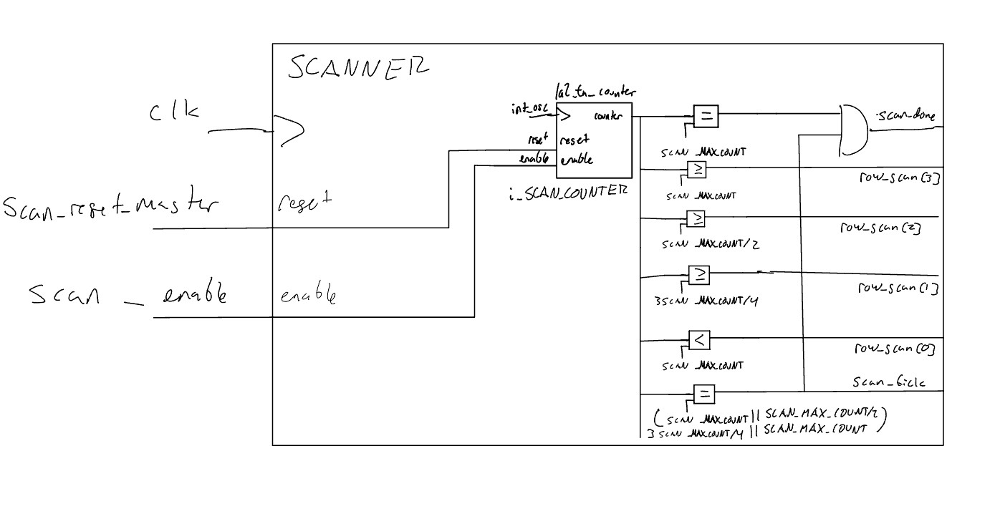

## Introduction

Lab 3 extends the Lab 2 keypad scanner into a complete keypad interface. The FPGA scans a 4x4 keypad, synchronizes the asynchronous column inputs, rejects switch bounce and invalid multi-key conditions, and displays the two most recent valid hexadecimal keys on the dual 7-segment display. Each valid press is registered once regardless of hold time.

The complete SystemVerilog source and testbenches are available in the [Lab 3 GitHub repository](https://github.com/thivenanderson/E155-Lab3).

## Hardware

The design reuses the 4x4 keypad interface and dual 7-segment display hardware from [Lab 2](../lab2/lab2.qmd). Keypad columns are active-low asynchronous FPGA inputs, while the row-driving and display-multiplexing hardware are reused from the previous lab.

{width=50%}

## Verilog Structure and Style

The top-level module contains only module instantiations and simple combinational connections. Previously verified Lab 1/2 modules are reused for the hexadecimal decoder and parameterized counters.

| Module | Function |
|---|---|
| `lab3_ta_sync` | Two-flop synchronization of the four asynchronous keypad columns |
| `lab3_ta_scanner` | Reused counter plus combinational logic to scan the four keypad rows |
| `lab3_ta_keypad_builder` | Captures each scanned row into a 16-bit keypad map |
| `lab3_ta_keypad_decoder` | Converts a one-hot keypad map into row, column, and hexadecimal values |
| `lab3_ta_controller` | Coordinates scanning, debounce timing, registration, and key release |
| `lab3_ta_savedkey_sr` | Stores the row and column of the candidate key |
| `lab3_ta_digit_sr` | Stores the newest and previous hexadecimal digits |

### Debouncing and Multi-Key Handling

After a complete scan, the controller accepts a candidate only when `$onehot(keypad)` is true. The selected row is then held active while the two-stage synchronizer settles. A reused counter requires the saved column to remain asserted for approximately 10 ms before generating a one-cycle `shift_enable` pulse.

Once a key is registered, the controller remains in `PRESSED` until that saved key is released. Additional keys are therefore ignored while the first key remains held. If several keys are detected during scanning, no key is saved; when the condition returns to exactly one held key, that remaining key can be registered.

This counter-based debounce is simple and deterministic. Its main tradeoff is a small fixed input delay. This delay of 10ms is excessive compared to oscilliscope measure debounce, but accounts for worst case scenarios.

### FSM Partitioning

The controller handles sequencing, while the scanner and debounce counter keep their own timing state and communicate with the controller using `scan_done`, `db_done`, reset, and enable signals. This keeps new state out of the top-level module and allows each stateful block to be tested independently.

## State Transition Diagram

```{mermaid}
stateDiagram-v2
    RESET --> SCAN
    SCAN --> CHECK: scan_done
    SCAN --> SCAN: !scan_done
    CHECK --> SAVE: one-hot keypad
    CHECK --> SCAN: else
    SAVE --> SETTLE
    SETTLE --> WAIT
    WAIT --> SCAN: saved column released
    WAIT --> PULSE: db_done
    WAIT --> WAIT: held and !db_done
    PULSE --> PRESSED
    PRESSED --> PRESSED: saved column low
    PRESSED --> SCAN: saved column released
```

## State Transition Table

| State | Next-state condition | Main asserted outputs |
|---|---|---|
| `SCAN` | `scan_done` -> `CHECK`; otherwise `SCAN` | `scan_enable`, `scan_reset` |
| `CHECK` | one-hot keypad -> `SAVE`; otherwise `SCAN` | `save_enable` for a valid one-hot key |
| `SAVE` | always -> `SETTLE` | none |
| `SETTLE` | always -> `WAIT` | none |
| `WAIT` | released -> `SCAN`; `db_done` -> `PULSE`; otherwise `WAIT` | `db_reset`, `db_enable` |
| `PULSE` | always -> `PRESSED` | `shift_enable` |
| `PRESSED` | released -> `SCAN`; otherwise `PRESSED` | none |

## Simulation and Verification

Every new module is covered by an automatic testbench. The previously verified generic counter and hexadecimal decoder are reused from [Lab 2](../lab2/lab2.qmd) and [Lab 1](../lab1/lab1.qmd), respectively, so their standalone simulations are not repeated.

The top-level keypad stimulus models active-low columns, asynchronous press timing, a transition directly on a system-clock edge, and switch bounce.

### Synchronizer

The waveform shows the two-stage delay: an asynchronous change first reaches the internal first-stage register and then appears at `q` on the following rising edge.

<details>
<summary>Synchronizer testbench waveform</summary>


</details>

### Keypad Scanner

The scanner testbench verifies the `1000 -> 0100 -> 0010 -> 0001` row sequence, matching row indices, scan ticks, wraparound, and enable behavior.

<details>
<summary>Scanner testbench waveform</summary>


</details>

### Keypad Builder

Each scan tick stores the inverted synchronized columns into the correct four-bit portion of the 16-bit keypad map. The waveform builds `16'h8000 -> 16'h8400 -> 16'h8420 -> 16'h8421`, with `scan_done` asserted on the final row.

<details>
<summary>Keypad-builder testbench waveform</summary>


</details>

### Keypad Decoder

The combinational decoder testbench steps through all 16 one-hot keypad positions and verifies the corresponding hexadecimal, row, and column outputs.

<details>
<summary>Keypad-decoder testbench waveform</summary>


</details>

### Saved-Key Register

The saved-key register captures the decoded row and column only when enabled and holds its previous value while disabled.

<details>
<summary>Saved-key register testbench waveform</summary>


</details>

### Digit Shift Register

The display register resets to `00`, loads `A`, shifts to `5A`, holds while disabled, and then shifts to `C5`.

<details>
<summary>Digit shift-register testbench waveform</summary>


</details>

### Controller FSM

The controller waveform covers asynchronous reset, rejection of a multi-key map, a valid `SCAN -> CHECK -> SAVE -> SETTLE -> WAIT -> PULSE -> PRESSED` sequence, debounce completion, one-cycle `shift_enable`, held-key behavior, release, and return to scanning.

<details>
<summary>Controller testbench waveform</summary>


</details>

## Top-Level Verification

### Asynchronous Reset

Reset immediately returns the controller to `SCAN` and clears the saved key and both displayed digits.

<details>
<summary>Top-level reset waveform</summary>


</details>

### Test 1: Bounce, Debounce, and Single Registration

The first waveform shows a bounced press of key `1` while the keypad continues scanning. After the complete keypad map contains one valid key, the controller leaves `SCAN` for `CHECK`.

<details>
<summary>Test 1a waveform</summary>


</details>

The second waveform shows the saved column settling through the synchronizer, the debounce counter reaching its terminal count, a one-cycle `shift_enable` pulse, and `digit1` updating to `1`. The controller then remains in `PRESSED`, preventing repeated registration while the key stays held.

<details>
<summary>Test 1b waveform</summary>


</details>

### Test 2: Two-Digit History

A valid press of key `5` produces the normal controller sequence and shifts the display history from `1,0` to newest=`5`, previous=`1`.

<details>
<summary>Test 2 waveform</summary>


</details>

### Test 3: First-Key Priority and Roll-Off

Key `2` registers first. Key `9` is then pressed while `2` remains held; the controller stays in `PRESSED` and the display remains unchanged. When `2` is released while `9` remains held, scanning resumes and `9` becomes the next valid key.

<details>
<summary>Test 3 waveform</summary>


</details>

### Tests 4 and 5: Simultaneous Multi-Key Input

Keys `3` and `C` are initially held together. The keypad map is not one-hot, so the controller continues scanning and the stored digits remain `9,2`. After `3` is released, `C` is the only remaining key and is registered as the next digit.

<details>
<summary>Tests 4 and 5 waveform</summary>


</details>

### Display Multiplexing

The final output test verifies the top-level connection from the digit registers through the reused display multiplexer and hexadecimal decoder. The saved waveform shows the `C` phase with the corresponding anode and segment output; the automatic testbench also asserts the opposite phase for the stored `9`.

<details>
<summary>Top-level display-multiplexing waveform</summary>


</details>

## Synthesis Output

Radiant synthesis completes without latch or tri-state warnings in the committed synthesis message log.


</details>

## Schematic

The Lab 3 hardware combines the keypad and dual-display circuits developed in Lab 2.

{width=100%}

## Block Diagrams
The top level diagram contains only instances of other modules and simple combinational logic.
{width=100%}

The scanning module block diagram is also included as it contains an instance of the counter module.
{width=100%}

## Requirements Verification

Automatic simulation verifies single-key operation, one-time registration, debounce behavior, two-digit history, first-key priority, rejection of simultaneous multi-key input, and registration of the final remaining key after multi-key roll-off. The display connection is also checked automatically.

The physical display behavior also meets all required specifications, proficient and excellent.

## AI Prototype and Reflection

Using ChatGPT and the provided prompt the model succesfully produced HDL that compiled after only one error. This error was the same as lab 1 where the model used outdated syntax to instantiate the high-frequency oscillator.

Preliminary reviews of the code suggest that it would not succesfully handle excellency roll off specification, however, it has the base structure down and used a similar full-keypad sweep methodology. I believe this shows it can be a very useful tool that does not make syntax errors, but all code must be closely reviewed and very specific prompts must be given.
<details>
<summary>AI Prototype Prompt SystemVerilog</summary>
// ============================================================
// Rate / clock-enable generator
// Generates a one-system-clock-wide tick at approximately TICK_HZ.
// ============================================================
module rate_tick #(
    parameter integer CLK_HZ  = 20_000_000,
    parameter integer TICK_HZ = 200
)(
    input  logic clk,
    input  logic reset_n,
    output logic tick
);

    localparam integer DIV = CLK_HZ / TICK_HZ;
    localparam integer WIDTH = $clog2(DIV);

    logic [WIDTH-1:0] count;

    always_ff @(posedge clk) begin
        if (!reset_n) begin
            count <= '0;
            tick  <= 1'b0;
        end
        else begin
            tick <= 1'b0;

            if (count == DIV-1) begin
                count <= '0;
                tick  <= 1'b1;
            end
            else begin
                count <= count + 1'b1;
            end
        end
    end

endmodule


// ============================================================
// 4x4 keypad scanner
//
// col_n : active-low column drive
// row_n : active-low row inputs
//
// A column remains selected for an entire scan interval, so the
// row signals have several milliseconds to settle before sampling.
//
// Once a key is detected:
//   SCAN -> WAIT_RELEASE
//
// WAIT_RELEASE continues scanning every column. A new key cannot
// register until one complete 4-column sweep contains no presses.
// ============================================================
module keypad_scanner_4x4 (
    input  logic       clk,
    input  logic       reset_n,
    input  logic       scan_tick,

    input  logic [3:0] row_n,
    output logic [3:0] col_n,

    output logic       key_valid,
    output logic [3:0] key_code
);

    typedef enum logic {
        SCAN,
        WAIT_RELEASE
    } state_t;

    state_t state;

    logic [1:0] col_idx;

    // Synchronize external keypad row signals into FPGA clock domain.
    logic [3:0] row_sync1;
    logic [3:0] row_sync2;

    logic       release_sweep_active;
    logic       release_sweep_any;

    // --------------------------------------------------------
    // Input synchronizer
    // --------------------------------------------------------
    always_ff @(posedge clk) begin
        if (!reset_n) begin
            row_sync1 <= 4'b1111;
            row_sync2 <= 4'b1111;
        end
        else begin
            row_sync1 <= row_n;
            row_sync2 <= row_sync1;
        end
    end

    // --------------------------------------------------------
    // Drive exactly one column low
    // --------------------------------------------------------
    always_comb begin
        col_n = 4'b1111;

        case (col_idx)
            2'd0: col_n = 4'b1110;
            2'd1: col_n = 4'b1101;
            2'd2: col_n = 4'b1011;
            2'd3: col_n = 4'b0111;
            default: col_n = 4'b1111;
        endcase
    end

    // --------------------------------------------------------
    // Key lookup
    //
    // Example hexadecimal keypad layout:
    //
    //        COL0 COL1 COL2 COL3
    // ROW0     1    2    3    A
    // ROW1     4    5    6    B
    // ROW2     7    8    9    C
    // ROW3     E    0    F    D
    //
    // Change this function if the physical keypad is wired
    // differently.
    // --------------------------------------------------------
    function automatic logic [3:0] decode_key(
        input logic [1:0] column,
        input logic [1:0] row
    );
        begin
            case ({row, column})
                4'b0000: decode_key = 4'h1;
                4'b0001: decode_key = 4'h2;
                4'b0010: decode_key = 4'h3;
                4'b0011: decode_key = 4'hA;

                4'b0100: decode_key = 4'h4;
                4'b0101: decode_key = 4'h5;
                4'b0110: decode_key = 4'h6;
                4'b0111: decode_key = 4'hB;

                4'b1000: decode_key = 4'h7;
                4'b1001: decode_key = 4'h8;
                4'b1010: decode_key = 4'h9;
                4'b1011: decode_key = 4'hC;

                4'b1100: decode_key = 4'hE;
                4'b1101: decode_key = 4'h0;
                4'b1110: decode_key = 4'hF;
                4'b1111: decode_key = 4'hD;

                default: decode_key = 4'h0;
            endcase
        end
    endfunction

    // --------------------------------------------------------
    // Scanner / debounce FSM
    // --------------------------------------------------------
    always_ff @(posedge clk) begin
        if (!reset_n) begin
            state                <= SCAN;
            col_idx              <= 2'd0;
            key_code             <= 4'h0;
            key_valid            <= 1'b0;
            release_sweep_active <= 1'b0;
            release_sweep_any    <= 1'b0;
        end
        else begin
            // key_valid is a one-clock pulse
            key_valid <= 1'b0;

            if (scan_tick) begin

                case (state)

                    // ----------------------------------------
                    // Normal scanning
                    // ----------------------------------------
                    SCAN: begin
                        if (row_sync2 != 4'b1111) begin

                            // If multiple rows are active,
                            // choose the first one by priority.
                            if (!row_sync2[0])
                                key_code <= decode_key(col_idx, 2'd0);
                            else if (!row_sync2[1])
                                key_code <= decode_key(col_idx, 2'd1);
                            else if (!row_sync2[2])
                                key_code <= decode_key(col_idx, 2'd2);
                            else
                                key_code <= decode_key(col_idx, 2'd3);

                            key_valid <= 1'b1;
                            state     <= WAIT_RELEASE;

                            // Do not accept a partial sweep as
                            // evidence of full release.
                            release_sweep_active <= 1'b0;
                            release_sweep_any    <= 1'b0;
                        end

                        col_idx <= col_idx + 2'd1;
                    end

                    // ----------------------------------------
                    // Ignore all keys until a COMPLETE sweep
                    // sees every row inactive.
                    // ----------------------------------------
                    WAIT_RELEASE: begin

                        // Start release checking at column 0 so
                        // the release decision always represents
                        // a full four-column sweep.
                        if (col_idx == 2'd0) begin
                            release_sweep_active <= 1'b1;
                            release_sweep_any    <=
                                (row_sync2 != 4'b1111);
                        end
                        else if (release_sweep_active) begin
                            if (row_sync2 != 4'b1111)
                                release_sweep_any <= 1'b1;
                        end

                        // Column 3 finishes a complete sweep.
                        if ((col_idx == 2'd3) &&
                            release_sweep_active) begin

                            // Include column 3 in the decision.
                            if (!release_sweep_any &&
                                (row_sync2 == 4'b1111)) begin
                                state <= SCAN;
                            end

                            release_sweep_active <= 1'b0;
                            release_sweep_any    <= 1'b0;
                        end

                        col_idx <= col_idx + 2'd1;
                    end

                    default: begin
                        state <= SCAN;
                    end

                endcase
            end
        end
    end

endmodule


// ============================================================
// Hex-to-seven-segment decoder
//
// Active-low segment outputs for a common-anode display.
// seg_n = {a,b,c,d,e,f,g}
// ============================================================
module hex7seg (
    input  logic [3:0] hex,
    output logic [6:0] seg_n
);

    always_comb begin
        case (hex)
            4'h0: seg_n = 7'b0000001;
            4'h1: seg_n = 7'b1001111;
            4'h2: seg_n = 7'b0010010;
            4'h3: seg_n = 7'b0000110;
            4'h4: seg_n = 7'b1001100;
            4'h5: seg_n = 7'b0100100;
            4'h6: seg_n = 7'b0100000;
            4'h7: seg_n = 7'b0001111;
            4'h8: seg_n = 7'b0000000;
            4'h9: seg_n = 7'b0000100;
            4'hA: seg_n = 7'b0001000;
            4'hB: seg_n = 7'b1100000;
            4'hC: seg_n = 7'b0110001;
            4'hD: seg_n = 7'b1000010;
            4'hE: seg_n = 7'b0110000;
            4'hF: seg_n = 7'b0111000;
            default: seg_n = 7'b1111111;
        endcase
    end

endmodule


// ============================================================
// Dual seven-segment display multiplexer
//
// digit_n[0] = right / most-recent digit
// digit_n[1] = left  / older digit
//
// Active-low digit enables assumed.
//
// Each digit is active for exactly one refresh interval, giving
// a 50% duty cycle and balanced brightness.
// ============================================================
module dual7seg_mux (
    input  logic       clk,
    input  logic       reset_n,
    input  logic       refresh_tick,

    input  logic [3:0] older_digit,
    input  logic [3:0] recent_digit,

    output logic [6:0] seg_n,
    output logic [1:0] digit_n
);

    logic digit_sel;
    logic [3:0] selected_hex;

    always_ff @(posedge clk) begin
        if (!reset_n)
            digit_sel <= 1'b0;
        else if (refresh_tick)
            digit_sel <= ~digit_sel;
    end

    // Right digit = most recent
    // Left digit  = older
    always_comb begin
        if (digit_sel == 1'b0) begin
            selected_hex = recent_digit;
            digit_n      = 2'b10;
        end
        else begin
            selected_hex = older_digit;
            digit_n      = 2'b01;
        end
    end

    hex7seg decoder (
        .hex   (selected_hex),
        .seg_n (seg_n)
    );

endmodule


// ============================================================
// Top level
//
// Uses the iCE40 high-frequency internal oscillator.
//
// CLKHF_DIV = "0b01" is commonly used to divide the native
// HFOSC frequency. Adjust CLK_HZ below to match the oscillator
// frequency used in the actual design / board configuration.
// ============================================================
module keypad_display_top (
    input  logic       reset_n,

    input  logic [3:0] keypad_row_n,
    output logic [3:0] keypad_col_n,

    output logic [6:0] seg_n,
    output logic [1:0] digit_n
);

    // Approximate system-clock rate assumed by the tick dividers.
    localparam integer CLK_HZ = 24_000_000;

    logic clk;

    logic scan_tick;
    logic refresh_tick;

    logic       key_valid;
    logic [3:0] key_code;

    logic [3:0] older_digit;
    logic [3:0] recent_digit;

    // --------------------------------------------------------
    // iCE40 UP5K internal high-frequency oscillator
    // --------------------------------------------------------
	HSOSC #(
		.CLKHF_DIV(2'b01)
	) hfosc_inst (
		.CLKHFPU(1'b1),
		.CLKHFEN(1'b1),
		.CLKHF  (clk)
	);

    // --------------------------------------------------------
    // Keypad scan rate
    //
    // 200 column samples / second:
    //     5 ms per column
    //     20 ms per complete keypad sweep
    // --------------------------------------------------------
    rate_tick #(
        .CLK_HZ (CLK_HZ),
        .TICK_HZ(200)
    ) scan_rate (
        .clk     (clk),
        .reset_n (reset_n),
        .tick    (scan_tick)
    );

    // --------------------------------------------------------
    // Display refresh
    //
    // Toggle digit at 1 kHz.
    // Each individual digit is therefore refreshed at 500 Hz,
    // comfortably above the visible-flicker range.
    // --------------------------------------------------------
    rate_tick #(
        .CLK_HZ (CLK_HZ),
        .TICK_HZ(1000)
    ) display_rate (
        .clk     (clk),
        .reset_n (reset_n),
        .tick    (refresh_tick)
    );

    // --------------------------------------------------------
    // Keypad scanner
    // --------------------------------------------------------
    keypad_scanner_4x4 keypad_scanner (
        .clk       (clk),
        .reset_n   (reset_n),
        .scan_tick (scan_tick),

        .row_n     (keypad_row_n),
        .col_n     (keypad_col_n),

        .key_valid (key_valid),
        .key_code  (key_code)
    );

    // --------------------------------------------------------
    // Two-key history
    //
    // Example:
    //   first press 5 -> [0][5]
    //   next press A  -> [5][A]
    // --------------------------------------------------------
    always_ff @(posedge clk) begin
        if (!reset_n) begin
            older_digit  <= 4'h0;
            recent_digit <= 4'h0;
        end
        else if (key_valid) begin
            older_digit  <= recent_digit;
            recent_digit <= key_code;
        end
    end

    // --------------------------------------------------------
    // Seven-segment multiplexer
    // --------------------------------------------------------
    dual7seg_mux display_mux (
        .clk          (clk),
        .reset_n      (reset_n),
        .refresh_tick (refresh_tick),

        .older_digit  (older_digit),
        .recent_digit (recent_digit),

        .seg_n        (seg_n),
        .digit_n      (digit_n)
    );

endmodule
</details>

## Time Spent

Total time spent on Lab 3: **25 hours**
