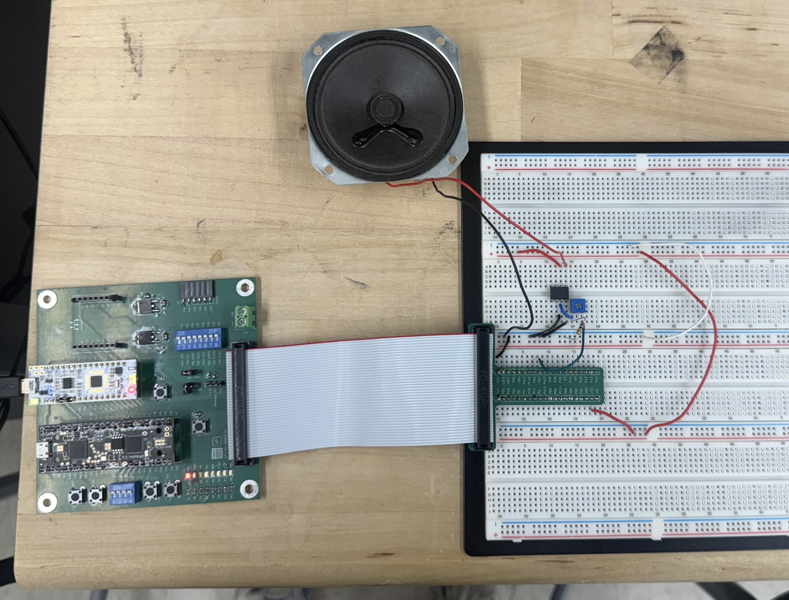
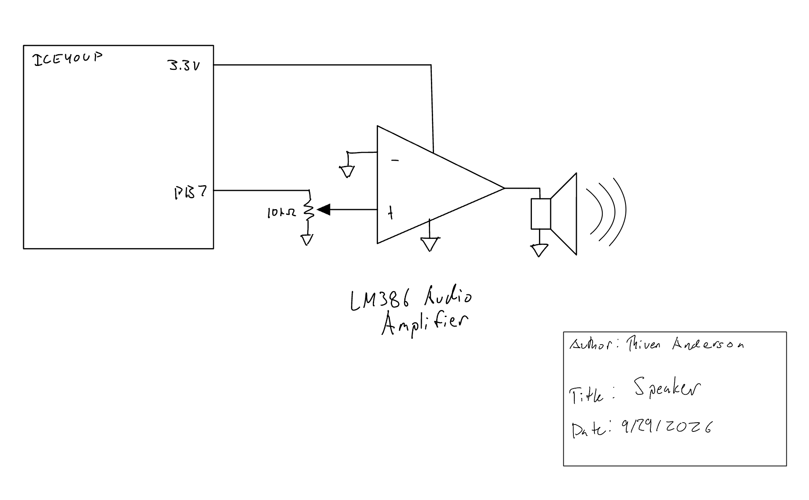
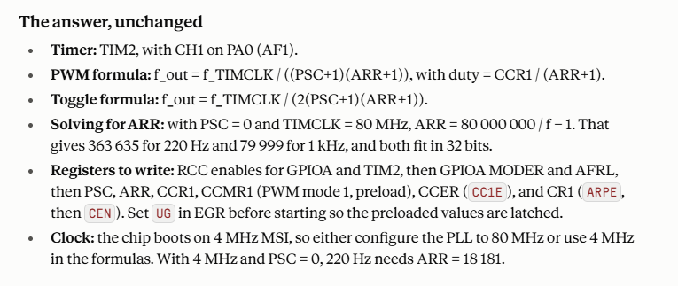

## Introduction

Lab 4 uses the STM32L432KC microcontroller to generate music as a sequence of square waves. Each note is represented by a pitch in Hz and a duration in ms. TIM6 controls the square-wave pitch by determining when the speaker GPIO toggles, while TIM7 independently controls how long each note or rest is played. A frequency of 0 is treated as a rest and the final `{0, 0}` entry marks the end of the song.

The implementation uses a custom timer library built from memory-mapped register definitions rather than CMSIS timer headers as specified by the lab. The provided Für Elise note array is used for the required song, and an additional compositions are supported.

The complete source code is available in the [Lab 4 GitHub repository](https://github.com/thivenanderson/E155-Lab4). 
The design was developed to satisfy the current [Lab 4 specifications](https://hmc-e155.github.io/lab/lab4/specs.html).

[STM32L432KC Reference Manual](https://hmc-e155.github.io/assets/doc/rm0394-stm32l41xxx42xxx43xxx44xxx45xxx46xxx-advanced-armbased-32bit-mcus-stmicroelectronics.pdf)

## Hardware

The MCU produces a square-wave audio signal on PB7. This signal is intended to drive an LM386 audio amplifier before reaching the 8 $\Omega$ speaker rather than driving the speaker directly from the GPIO.

Before connecting the speaker, the PB7 output was checked on an oscilloscope using a 440 Hz test note. The initial implementation assumed an exact 80 MHz timer clock and consistently measured approximately 436--436.25 Hz. A frequency of 991 Hz was also measured with 1000 Hz which should me more accurate as ARR should be an exact integer for that note with my 10KHz clock. Because the measured frequency was consistently about 0.9% low, the effective timer clock was estimated from the measurement and the software timing constants were calibrated accordingly.

{width=50%}

### Oscilloscope Verification

The initial 440 Hz test used a TIM6 prescaler of 79. With an ARR value of 1135, the measured output of approximately 436.1 Hz implies a TIM6 counter frequency of approximately

$$
f_{CNT6} = 2f_{measured}(ARR+1)
$$

$$
f_{CNT6} \approx 2(436.1)(1136)
\approx 991\text{ kHz}.
$$

This was confirmed by the oscilloscope reading for a 1 kHz note. Multiplying by the prescaler division factor of 80 gives an effective timer input clock of approximately

$$
f_{TIM} \approx 991\text{ kHz}\times80
=79.28\text{ MHz}.
$$

This measured value is used in the final timer calculations rather than assuming an exact 80 MHz clock.

[TODO: add final oscilloscope screenshot(s), including a calibrated test frequency and note duration.]

## Software and Microcontroller Design

### Timer Library

TIM6 and TIM7 are accessed through a custom `TIMx_TypeDef` register structure and manually defined base addresses. The timer library contains generic functions for timer initialization and basic timer operations rather than application-specific audio functions.

The same `initTIM()` function initializes either TIM6 or TIM7 using a timer pointer and prescaler value. Raw register bit manipulation is contained inside the timer library through functions such as `startTIM()`, `stopTIM()`, `resetTIM()`, `setTIMARR()`, `timerDone()`, and `clearTIMFlag()`. This keeps the library reusable and prevents the application code from mixing high-level audio behavior with low-level register operations.

<details>
<summary>Timer library interface</summary>

```c
void initTIM(TIMx_TypeDef *TIMx, uint16_t prescaler);
void startTIM(TIMx_TypeDef *TIMx);
void stopTIM(TIMx_TypeDef *TIMx);
void resetTIM(TIMx_TypeDef *TIMx);
void setTIMARR(TIMx_TypeDef *TIMx, uint16_t arr);
int timerDone(TIMx_TypeDef *TIMx);
void clearTIMFlag(TIMx_TypeDef *TIMx);
```

</details>

### Audio Control

Application-specific audio behavior is kept in `main.c`. The speaker pin, calibrated timer clock, timer prescalers, pitch conversion, duration conversion, and `playNote()` function are all defined at the application level.

TIM6 is configured with a prescaler of 79, giving a calibrated counter frequency of

$$
f_{CNT6}=\frac{79.28\text{ MHz}}{79+1}
=991000\text{ Hz}.
$$

TIM7 is configured with a prescaler of 7999, giving

$$
f_{CNT7}=\frac{79.28\text{ MHz}}{7999+1}
=9910\text{ Hz}.
$$

For a normal note, TIM6 runs continuously while TIM7 measures the total note duration. Each TIM6 update event toggles PB7 and clears the update flag. When TIM7 reaches its update event, both timers are stopped and PB7 is forced low.

A rest follows the same TIM7 duration timing but leaves TIM6 stopped and holds the speaker output low. This also prevents the pitch calculation from ever being called with a frequency of zero, avoiding division by zero.

<details>
<summary>Audio timing functions</summary>

```c
int frequencyToARR(int frequency) {
    return (TIM6_COUNT_HZ/(2*frequency)) - 1;
}

int durationToARR(int duration_ms) {
    return ((duration_ms*TIM7_COUNT_HZ)/1000) - 1;
}
```

</details>

## Design Calculations

### Pitch Calculation

TIM6 generates one GPIO transition per timer overflow. A complete square-wave period requires two transitions, so the generated pitch is

$$
f_{note}=\frac{f_{CNT6}}{2(ARR+1)}.
$$

Solving for ARR gives

$$
ARR=\frac{f_{CNT6}}{2f_{note}}-1.
$$

Because ARR must be an integer, the implementation uses integer arithmetic. As one example, for a requested 440 Hz pitch,

$$
ARR=\left\lfloor\frac{991000}{2(440)}\right\rfloor-1
=1125.
$$

The corresponding generated frequency is

$$
f_{actual}=\frac{991000}{2(1125+1)}
\approx440.053\text{ Hz},
$$

which has an error of approximately

$$
\frac{|440.053-440|}{440}\times100
\approx0.012\%.
$$

### Required 220 Hz and 1000 Hz Checks

For 220 Hz,

$$
ARR=\left\lfloor\frac{991000}{2(220)}\right\rfloor-1
=2251,
$$

giving

$$
f_{actual}=\frac{991000}{2(2251+1)}
\approx220.027\text{ Hz},
$$

or approximately **0.012% error**.

For 1000 Hz,

$$
ARR=\left\lfloor\frac{991000}{2(1000)}\right\rfloor-1
=494,
$$

giving

$$
f_{actual}=\frac{991000}{2(494+1)}
\approx1001.01\text{ Hz},
$$

or approximately **0.101% error**. Both are within the required 1% accuracy.

### Für Elise Note Accuracy

Checking only 220 Hz and 1000 Hz is not sufficient to prove that every Für Elise note is within 1%. ARR is restricted to integer values, so integer calculation error changes with target frequency rather than remaining constant. In addition, the provided song includes a 1319 Hz note, which lies above the 1000 Hz test point.

Every distinct nonzero pitch in the provided Für Elise array therefore needs to be checked using the actual integer ARR calculation. Using the calibrated 991 kHz TIM6 counter, the calculated worst-case error among the Für Elise pitches is approximately **0.177% at 1319 Hz**, which remains below the 1% requirement.

[Note Accuracy Spreadsheet](images/Note_Accuracy_Sheet.pdf)

### Duration Calculation

TIM7 runs at 9910 counts/s. For a requested duration in milliseconds,

$$
ARR=\left\lfloor\frac{t_{ms}(9910)}{1000}\right\rfloor-1.
$$

For example, a 250 ms note uses

$$
ARR=\left\lfloor\frac{250(9910)}{1000}\right\rfloor-1
=2476.
$$

The resulting duration is

$$
t_{actual}=\frac{2476+1}{9910}
\approx0.24995\text{ s}
=249.95\text{ ms}.
$$

This differs from 250 ms by approximately 0.020%.

### Supported Frequency Range

TIM6 is a 16-bit timer, so ARR can range from 0 to 65535 with the selected prescaler. The minimum timer-generated square-wave frequency occurs at `ARR = 65535`:

$$
f_{min}=\frac{991000}{2(65535+1)}
\approx7.56\text{ Hz}.
$$

The theoretical maximum occurs at `ARR = 0`:

$$
f_{max}=\frac{991000}{2}
=495.5\text{ kHz}.
$$

The upper value is the mathematical limit of the timer configuration. The required audio frequencies are far below this limit.

### Supported Duration Range

TIM7 is also a 16-bit timer. One TIM7 count lasts

$$
T_{tick}=\frac{1}{9910}
\approx0.1009\text{ ms}.
$$

Therefore the minimum timer overflow period is approximately **0.1009 ms**, while the maximum single-overflow duration is

$$
t_{max}=\frac{65536}{9910}
\approx6.613\text{ s}.
$$

The current note format specifies duration as an integer number of milliseconds and reserves a duration of 0 as the song terminator. Therefore the smallest nonzero duration that can currently be requested by the application interface is 1 ms, even though the timer itself has finer resolution.


## Schematic

The schematic shows only the off-board audio circuit: the MCU output connection, LM386 amplifier, speaker, power/ground connections, and any external volume-control components used in the final hardware. Components already present on the development board are not duplicated.

{width=50%}

## Requirements Verification

The timer driver uses manually defined memory-mapped register structures and base addresses, and the application uses TIM6 and TIM7 for pitch and duration generation. The note and duration calculations above demonstrate the relationship between the timer configuration and generated audio and show that 220 Hz and 1000 Hz can be generated within 1%.

The code explicitly separates rests from normal notes, so a zero-frequency rest never enters the frequency division calculation. The `{0, 0}` terminator is excluded from the playback loop.

The provided Für Elise pitches are mathematically reproducible to within 1% using the calibrated timer clock. \

The speaker successfully played both Für Elise and the additional composition.

## AI Prototype and Reflection
This week I used Claude Sonnet 5.5 to complete the AI overview. After the initial prompt the agent produced logically sound architecture
similar to my work, except for a few key differences. The agent elected to use TIM2 as it has a PWM output and a 32-bit register for ARR. With thism
methodology only one timer peripheral is required, and ARR has a large enough range that PSC can be set to 0. It noted for easier calculations
a PSC value of 79 would be suitable to form a 1MHz clock which was the same as my reasoning. The agent performed calculations with a 80 MHz clock, but later in
the response it acknowledged for this specific microcontroller this would need to be configures in PLL. The response was unchanged when provided
the data sheet.

{width=50%}

## Time Spent

Total time spent on Lab 4: **15**
